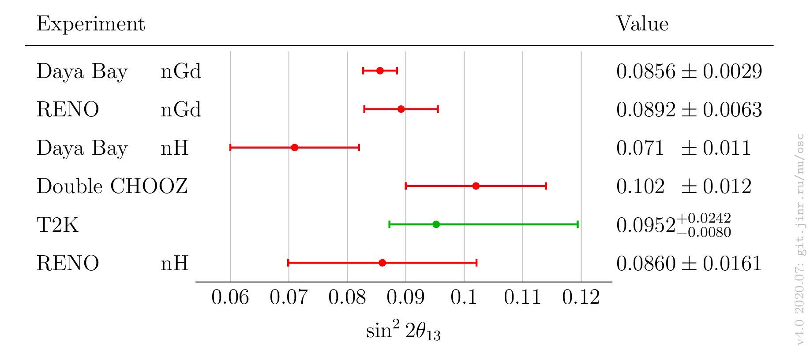

Neutrino oscillation parameters comparison

# Latest plots

# All plots

| $`\sin^22\theta_{13}`$ | $`\sin^22\theta_{12}`$ | $`\sin^2\theta_{23}`$ | $`\Delta m^2_{32}`$ | $`\Delta m^2_{21}`$ | $`\delta_\mathrm{CP}`$ |
| ------ | ------ | ------ | ------  | ------ | ------ |
| [v4.0b](plots/theta13/v4.0-neutrino2020) | | | | | |

