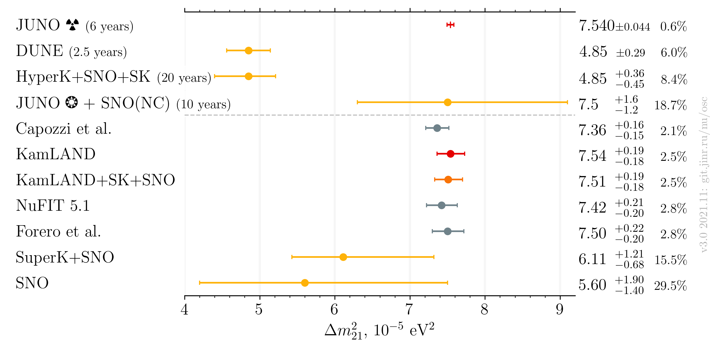
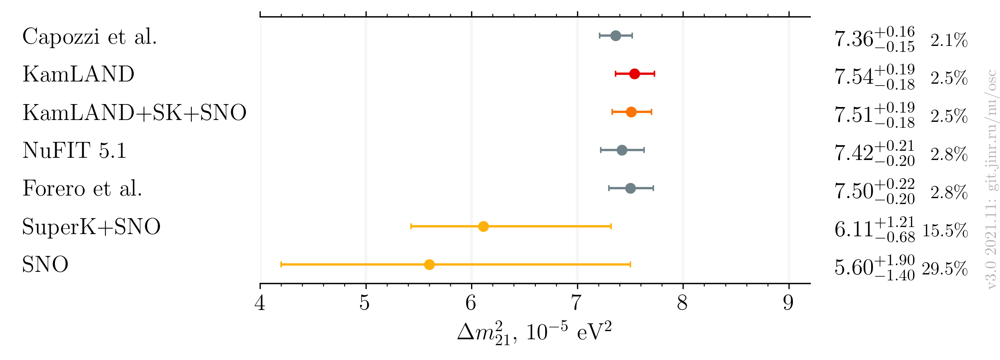
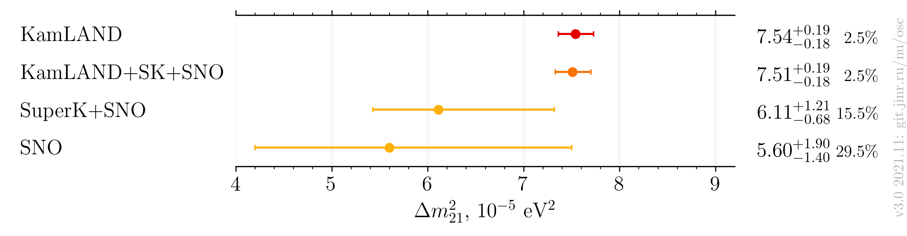

# $`\Delta m^2_{21}`$ measurements comparison, after Neutrino 2020

- Version: **3.0**
- Updates since v2.0:
    * Add future experiments
- [Plotting scripts](samples/dm21/dm21-v3.0-future)
- [Data table](dm21_v3-0.dat)
- References:
    - [KamLAND+SNO+SuperK](data/kamland+sk+sno_2020-07-neutrino2020.yaml)
    - [SNO+SuperK](data/sk+sno_2020-07-neutrino2020.yaml)
    - [KamLAND](data/kamland_2020-07-neutrino2020.yaml)
    - [SNO](data/sno_2020-07-neutrino2020.yaml)
    - [NuFIT 5.1](data/theor_nufit_5_1_2021-10.yaml)
    - [Forero et al.](data/theor_forero_2020-06-pre-neutrino2020.yaml)
    - JUNO estimation:
        * [JUNO Yellow Book](data/juno_future_2015-07-reactor.yaml)
        * [JUNO Solar ⁸B](data/juno_future_2020-06-solar.yaml)
    - [FUTURE] TBD
- Cross checks by:
    * @ldkolupaeva
    * @maxfl
- Notes:
    * Forero et al. is pre-Neutrino fit

## Including global analyses and future experiments

## Including global analyses

## Experiments only

