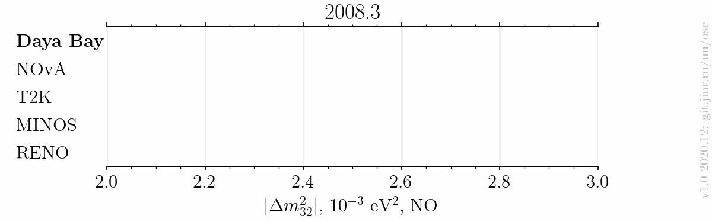

# Published $`|\Delta m^2_{32}|`$ measurements animation till 2020

- Version: 1.0 with Normal Neutrino Mass Ordering
- [Plotting scripts](samples/dm32-anim/dm32-anim-v1.0)
- Data tables, references included:
    * [Daya Bay](data/dm32-dayabay-anim_v1-0.dat)
    * [NOvA](data/dm32-nova-anim_v1-0.dat)
    * [T2K](data/dm32-t2k-anim_v1-0.dat)
    * [MINOS](data/dm32-minos-anim_v1-0.dat)
    * [RENO](data/dm32-reno-anim_v1-0.dat)
    * See also a complete [collection](../../../../data).
- Conversions:
    * Effective mass splitting $`|\Delta m^2_\mathrm{ee}|`$ conversion (RENO):
        + $`|\Delta m^2_{32}| = |\Delta m^2_\mathrm{ee}| - \alpha \cos^2\theta_{12} \Delta m^2_{21}`$.
    * $`|\Delta m^2_\mathrm{31}|`$ to $`|\Delta m^2_\mathrm{32}|`$ conversion:
        + $`|\Delta m^2_{32}| = |\Delta m^2_\mathrm{31}| - \alpha |\Delta m^2_\mathrm{21}| `$.
    * $`\alpha`$ is +1/-1 for NO/IO.
    * PDG 2020 values:
        + $`\sin^2\theta_{12} = 0.307`$
        + $`\Delta m^2_{21} = 7.53\cdot10^{-5}\text{ eV}^2`$
    * Asymmetric syst/stat errors conversion: quadratically sum left and right part of each (stat/syst) contribution independently
- Cross checks by:
    * David Jaffe
    * @ldkolupaeva
    * @maxfl

