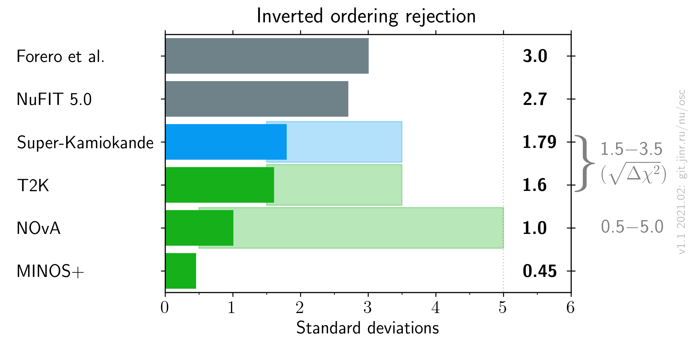

# Neutrino mass ordering measurements comparison, updated after Neutrino 2020

- Version: 1.1
- [Plotting scripts](samples/mo/v1.1-neutrino2020)
- References:
    * [MINOS+](data/minos_2020-07-neutrino2020.yaml)
    * [T2K](data/t2k_2020-07-neutrino2020.yaml)
    * [SuperK](data/superk_2020-07-neutrino2020.yaml)
    * [NOvA](data/nova_2020-07-neutrino2020.yaml)
    * [NuFIT 5.0](data/theor_nufit_2020-07-post-neutrino2020.yaml)
    * [Forero et al.](data/theor_forero_2020-06-pre-neutrino2020.yaml)
- Cross checks by:
    * @malyshkin
    * @ldkolupaeva
    * @maxfl
- Notes:
    * Forero et al. is pre-Neutrino version.
    * NMO 2020 sensitivity:
        + SuperK $`\sigma`$ is extracted as $`\sqrt{\Delta\chi^2}`$; official statement is 71.4-90.3% CLs disfavor for IH.
        + T2K $`\sigma`$ is extracted from  $`\sqrt{\Delta\chi^2}`$ plot for $`\delta_{CP}`$; official statement is >1$`\sigma`$.
    * Grey MO numbers on right axis are experiment maximal sensitivities. 
        + For T2K and SK 3.5 $`\sigma`$ is expected result of a joint fit.
    * Shaded areas are expected sensitivity ranges.

 

