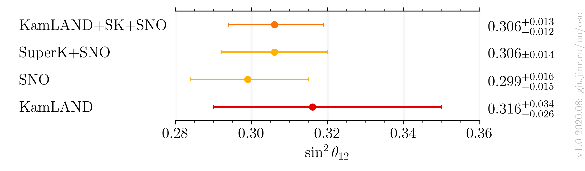
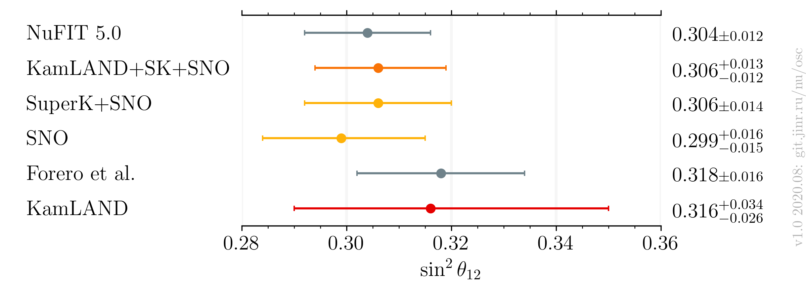

# $`\sin^2 \theta_{12}`$ measurements comparison, after Neutrino 2020

- Version: 1.0
- [Plotting scripts](samples/theta12/v1.0-neutrino2020)
- References:
    - [KamLAND+SNO+SuperK](data/kamland+sk+sno_2020-07-neutrino2020.yaml)
    - [SNO+SuperK](data/sk+sno_2020-07-neutrino2020.yaml)
    - [KamLAND](data/kamland_2020-07-neutrino2020.yaml)
    - [SNO](data/sno_2020-07-neutrino2020.yaml)
    - [NuFIT 5.0](data/theor_nufit_2020-07-post-neutrino2020.yaml)
    - [Forero et al.](data/theor_forero_2020-06-pre-neutrino2020.yaml)
- Cross checks by:
    * @ldkolupaeva
    * @maxfl
- Notes:
    * Forero et al. is pre-Neutrino fit
    * $`\tan^2 \theta_{12}`$ to $`\sin^2 \theta_{12}`$ conversion:
        + $`\sin^2 \theta_{12} = 1 - 1/(1+\tan^2 \theta_{12})`$.

| Experiments only             | Including global                    |
|------------------------------|-------------------------------------|
|  |  |

