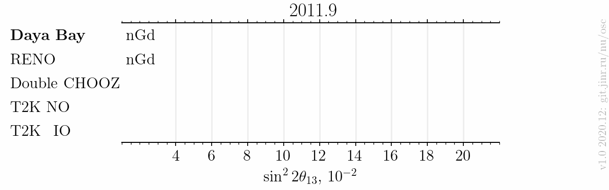

# Published $`\sin^22\theta_{13}`$ measurements animation till 2020

- Version: 1.0
- [Plotting scripts](samples/theta13-anim/theta13-anim-v1.0)
- Data tables, references included:
    * [Daya Bay](data/theta13-dayabay-anim_v1-0.dat)
    * [RENO](data/theta13-reno-anim_v1-0.dat)
    * [Double CHOOZ](data/theta13-dchooz-anim_v1-0.dat)
    * T2K:
        + [T2K NO](data/theta13-t2k_NO-anim_v1-0.dat)
        + [T2K IO](data/theta13-t2k_IO-anim_v1-0.dat)
    * See also a complete [collection](../../../../data).
- Cross checks by:
    * David Jaffe
    * @ldkolupaeva
    * @maxfl

