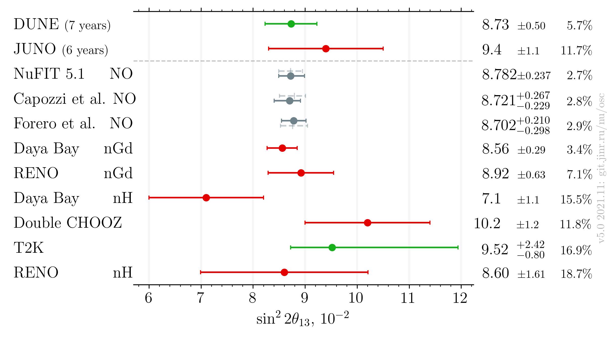
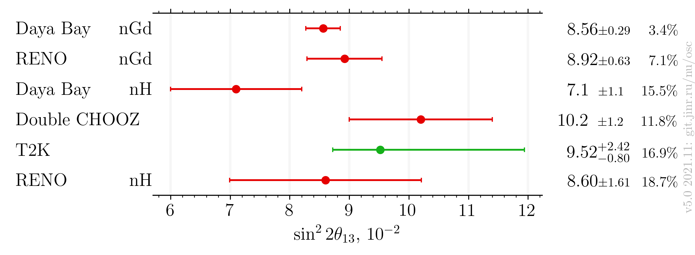

# $`\sin^22\theta_{13}`$ measurements comparison, updated after Neutrino 2020

- Version: **5.0**
- Updates since v4.1:
    * Add future experiments
- [Plotting scripts](samples/theta13/theta13-v5.0-future)
- [Data table](theta13_v5-0.dat)
- Cross checks by:
    * @ldkolupaeva
    * @maxfl
- Notes:
    * Forero et al. is pre-Neutrino fit
    * dashed grey bar in theoretical entry means IO

## Latest results

###  Including global analyses and future experiments

### Experiments only

## References

| Measurement    |                                                               Latest |
|----------------|---------------------------------------------------------------------:|
| Capozzi et al. |                 [hep-ph/2107.00532](data/theor_capozzi_2021-07.yaml) |
| DUNE           |                  [hep-ex/2006.16043](data/dune_future_2020_acc.yaml) |
| Daya Bay nGd   |              [Neutrino 2022](data/dayabay_2022-06-neutrino2022.yaml) |
| Daya Bay nH    |          [hep-ex/1603.03549](data/dayabay_2016-07-neutrino2016.yaml) |
| Double CHOOZ   |               [Neutrino 2020](data/dchooz_2020-07-neutrino2020.yaml) |
| Forero et al.  | [hep-ph/2006.11237](data/theor_forero_2020-06-pre-neutrino2020.yaml) |
| JUNO           |           [hep-ex/2204.13249](data/juno_future_2022-04-reactor.yaml) |
| NuFIT 5.1      |                       [NuFIT 5.1](data/theor_nufit_5_1_2021-10.yaml) |
| RENO           |                 [Neutrino 2020](data/reno_2020-07-neutrino2020.yaml) |
| T2K            |                  [Neutrino 2020](data/t2k_2020-07-neutrino2020.yaml) |
