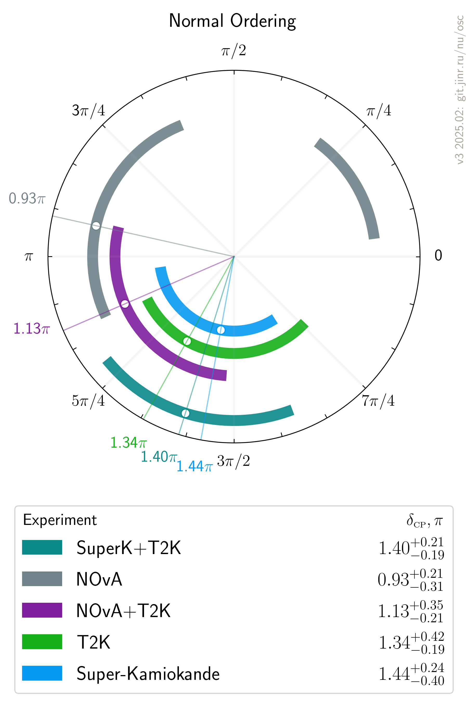
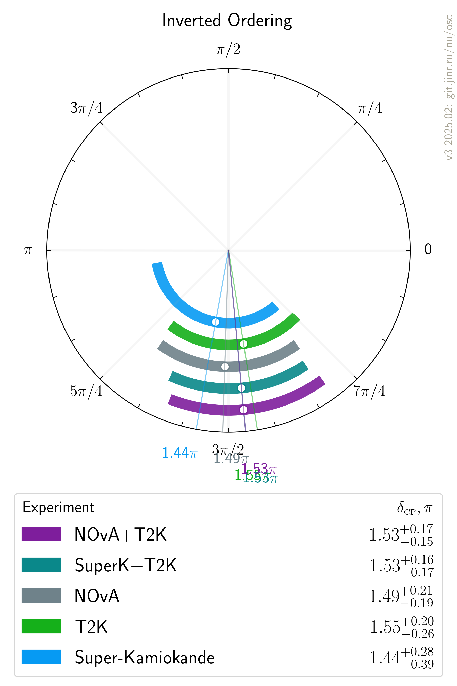

# $`\delta_{\scriptscriptstyle\mathrm{CP}}`$ measurements comparison

- Version: 3
- [Plotting scripts](samples/deltaCP/v2.1)
- Data tables:
    * [NO table](deltaCP_NO_v2-1.dat)
    * [IO table](deltaCP_IO_v2-1.dat)
- References:
    * [T2K](data/t2k_2020-07-neutrino2020.yaml)
    * [SuperK](data/superk_2020-07-neutrino2020.yaml)
    * [NOvA](data/nova_2020-07-neutrino2020.yaml)
    * [NuFIT 5.2](data/theor_nufit_5_2_2022-11.yaml)
    * [de Salas et al.](data/theor_forero_2020-06-pre-neutrino2020.yaml)
- Previous version: [v2.1](plots/deltaCP/v2.0-neutrino2020). Updates:
    * NuFIT ...
- Cross checks by:
    * @ldkolupaeva
    * @maxfl

| Normal ordering                        | Inverted Ordering                      |
| ---                                    | ---                                    |
|  |  |

