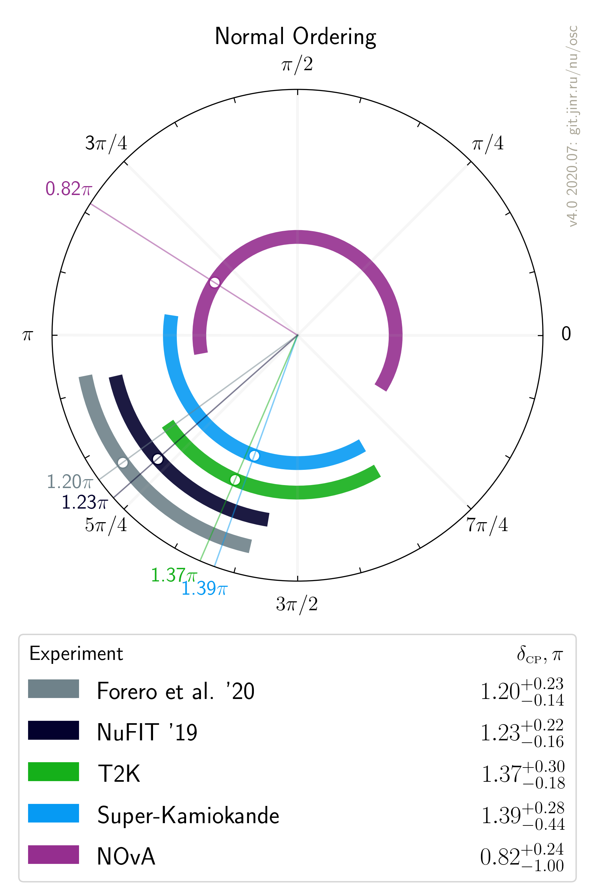
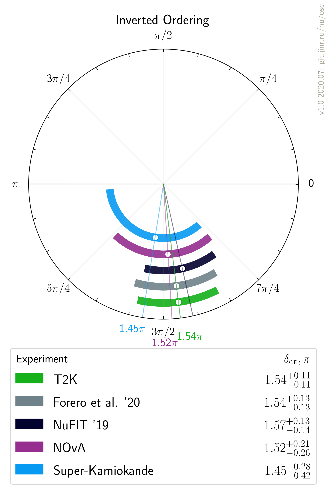

# $`\delta_{\scriptscriptstyle\mathrm{CP}}`$ measurements comparison, updated after Neutrino 2020

- Version: 1.0 beta
- [Plotting scripts](samples/deltaCP/v1.0-neutrino2020)
- Data tables:
    * [NO table](deltaCP_NO.dat)
    * [IO table](deltaCP_IO.dat)

