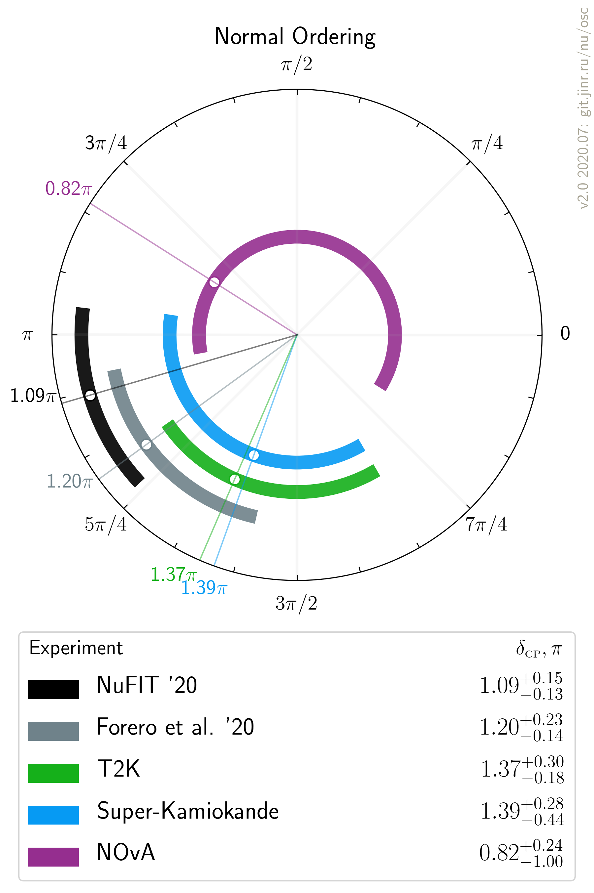

# $`\delta_{\scriptscriptstyle\mathrm{CP}}`$ measurements comparison, updated after Neutrino 2020

- Version: 2.0 beta
- [Plotting scripts](samples/deltaCP/v2.0-neutrino2020)
- Data tables:
    * [NO table](deltaCP_NO_v2-0.dat)
    * [IO table](deltaCP_IO_v2-0.dat)
- References:
    * [T2K](data/t2k_2020-07-neutrino2020.yaml)
    * [SuperK](data/superk_2020-07-neutrino2020.yaml)
    * [NOvA](data/nova_2020-07-neutrino2020.yaml)
    * [NuFIT](data/theor_nufit_2020-07-post-neutrino2020.yaml)
    * [Forero et al.](data/theor_forero_2020-06-pre-neutrino2020.yaml)
- Previous version: [v1.0](plots/deltaCP/v1.0-neutrino2020). Updates:
    * NuFIT on Neutrino 2020 data 
- Cross checks by:
    * @maxfl

| Normal ordering                  | Inverted Ordering                |
| ---                              | ---                              |
|  |  |

