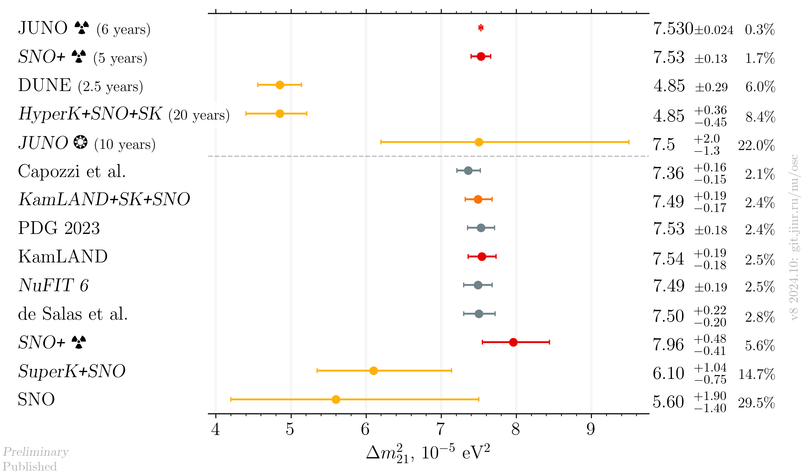
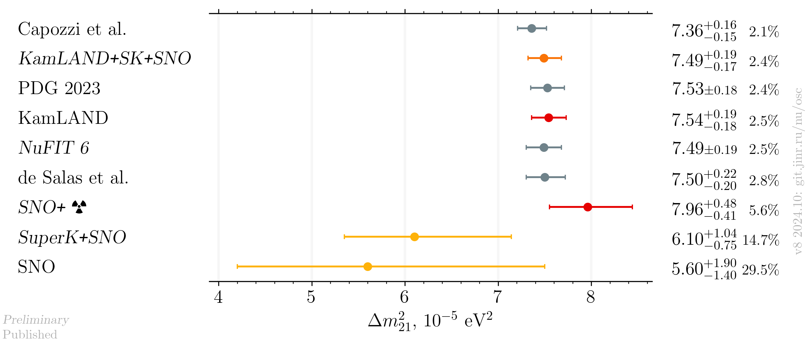
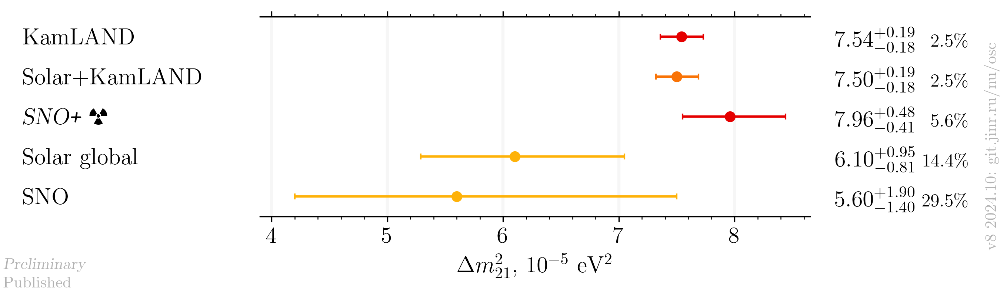

# $`\Delta m^2_{21}`$ measurements comparison

- Version: **8**
- Updates since v7:
    * Update to NuFIT 6
    * SK+SNO is now taking into account other solar experiments ' measurements and thus called Solar global
    * SK published new results
    * PDG 2024 was released 
    * SNO+ results with reactor neutrinos
    * Published JUNO solar sensitivity
- [Plotting scripts](samples/dm21/dm21-v8-)
- Data tables:
    * [published](dm21_v8_published.dat)
    * [latest](dm21_v8_latest.dat)
- Cross checks by:
    * @ldkolupaeva
- Notes:
    * de Salas et al. and Capozzi et al. are pre-Neutrino 2024 fits
    * SNO+ central value is from PDG 2022

## Plots

### Including global analyses and future experiments

### Including global analyses

### Experiments only

## References

| Measurement     |                                                                                                            Published |                                                                                                                  Latest |
|-----------------|---------------------------------------------------------------------------------------------------------------------:|------------------------------------------------------------------------------------------------------------------------:|
| Capozzi et al.  |                                                                 [hep-ph/2107.00532](data/theor_capozzi_2021-07.yaml) |                                                                                                                         |
| DUNE            |                                                                  [hep-ph/1808.08232](data/dune_future_2018_sol.yaml) |                                                                                                                         |
| de Salas et al. |                                                 [hep-ph/2006.11237](data/theor_forero_2020-06-pre-neutrino2020.yaml) |                                                                                                                         |
| HyperK          |                                                                                                                      |                                                                           [ICHEP2020](data/hyperk_future_2020_sol.yaml) |
| JUNO            | [hep-ex/2204.13249](data/juno_future_2022-04-reactor.yaml), [hep-ex/2210.08437](data/juno_future_2022-10-solar.yaml) |                                                                                                                         |
| KamLAND         |                                                          [hep-ex/1606.07538](data/kamland_2020-07-neutrino2020.yaml) |                                                                                                                         |
| NuFIT 6         |                                                                           [NuFIT 6](data/theor_nufit_6_2024-10.yaml) |                                                                                                                         |
| PDG             |                                                                                      [PDG](data/theor_pdg_2024.yaml) |                                                                                                                         |
| SNO             |                                                               [hep-ex/1109.0763](data/sno_2020-07-neutrino2020.yaml) |                                                                                                                         |
| SNO+            |                                                                                                                      | [Neutrino 2022](data/snoplus_future_2023-reactor.yaml), [Neutrino 2024](data/snoplus_2024-06-neutrino2024-reactor.yaml) |
| Solar global    |                                                                [hep-ex/2312.12907](data/kamland+sk+sno_2023-12.yaml) |                                                                                                                         |
| Solar+KamLAND   |                                                                [hep-ex/2312.12907](data/kamland+sk+sno_2023-12.yaml) |                                                                                                                         |

