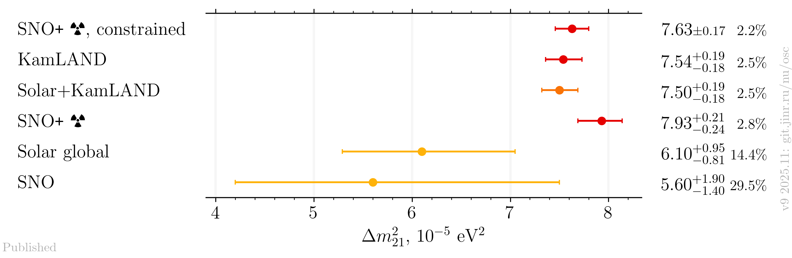
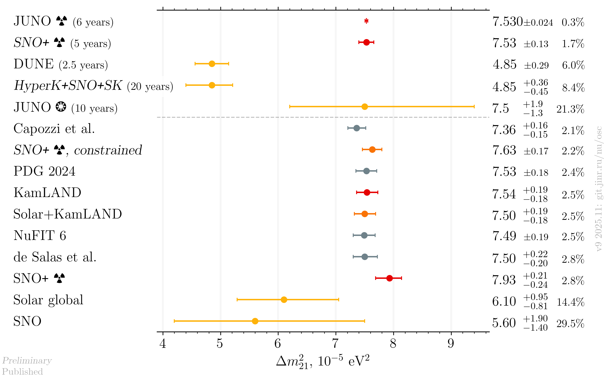
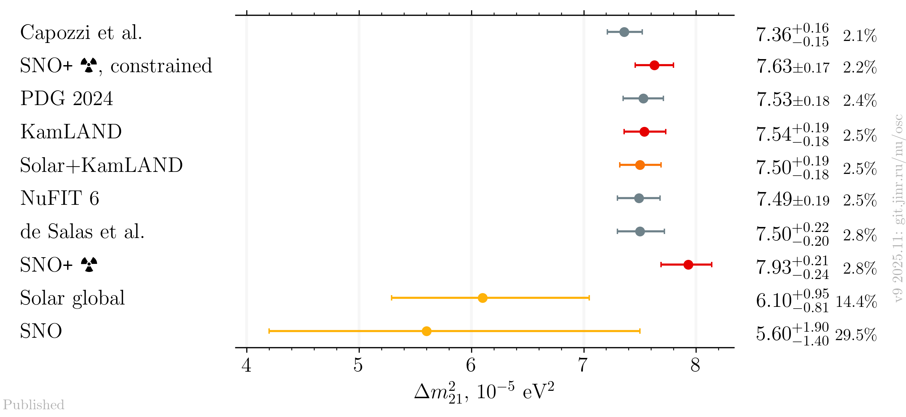

# $`\Delta m^2_{21}`$ measurements comparison

- Version: **9**
- Updates since v8:
  - Add SNO+
  - Add JUNO
- [Plotting scripts](samples/dm21/dm21-v9-)
- Data tables:
    * [published](dm21_v9_published.dat)
    * [latest](dm21_v9_latest.dat)
- Cross checks by:
  - @ldkolupaeva
- Notes:
  - de Salas et al. and Capozzi et al. are pre-Neutrino 2024 fits
  - SNO+ central value for sensitivity is from PDG 2022

## Plots

### Experiments only

### Including global analyses and future experiments

### Including global analyses

## References

| Measurement       |                                                                                                            Published |                                                  Latest |
|-------------------|---------------------------------------------------------------------------------------------------------------------:|--------------------------------------------------------:|
| Capozzi et al.    |                                                                 [hep-ph/2107.00532](data/theor_capozzi_2021-07.yaml) |                                                         |
| DUNE              |                                                                  [hep-ph/1808.08232](data/dune_future_2018_sol.yaml) |                                                         |
| de Salas et al.   |                                                 [hep-ph/2006.11237](data/theor_forero_2020-06-pre-neutrino2020.yaml) |                                                         |
| HyperK            |                                                                                                                      |           [ICHEP2020](data/hyperk_future_2020_sol.yaml) |
| JUNO              |                                                                                                                      |             [hep-ex/2511.14593](data/juno_2025-11.yaml) |
| JUNO sensitivity  | [hep-ex/2204.13249](data/juno_future_2022-04-reactor.yaml), [hep-ex/2210.08437](data/juno_future_2022-10-solar.yaml) |                                                         |
| KamLAND           |                                                          [hep-ex/1606.07538](data/kamland_2020-07-neutrino2020.yaml) |                                                         |
| NuFIT 6           |                                                                           [NuFIT 6](data/theor_nufit_6_2024-10.yaml) |                                                         |
| PDG 2024          |                                                                                      [PDG](data/theor_pdg_2024.yaml) |                                                         |
| SNO               |                                                               [hep-ex/1109.0763](data/sno_2020-07-neutrino2020.yaml) |                                                         |
| SNO+              |                                                                       [hep-ex/2505.04469](data/snoplus_2025-05.yaml) |          [hep-ex/2511.11856](data/snoplus_2025-11.yaml) |
| SNO+, constrained |                                                              [hep-ex/2505.04469](data/snoplus_2025-05_combined.yaml) | [hep-ex/2511.11856](data/snoplus_2025-11_combined.yaml) |
| SNO+, sensitivity |                                                                                                                      |  [Neutrino 2022](data/snoplus_future_2023-reactor.yaml) |
| Solar global      |                                                                [hep-ex/2312.12907](data/kamland+sk+sno_2023-12.yaml) |                                                         |
| Solar+KamLAND     |                                                                [hep-ex/2312.12907](data/kamland+sk+sno_2023-12.yaml) |                                                         |
