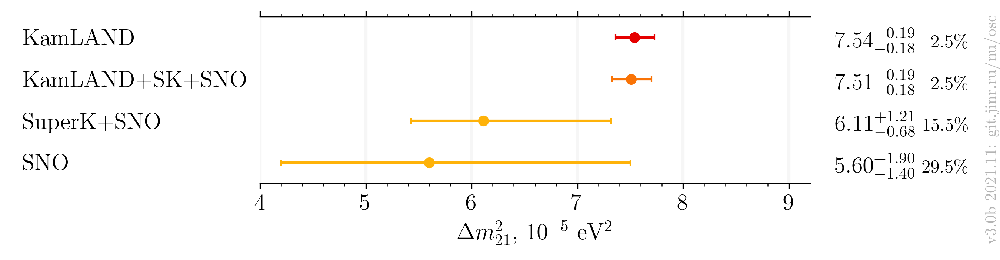
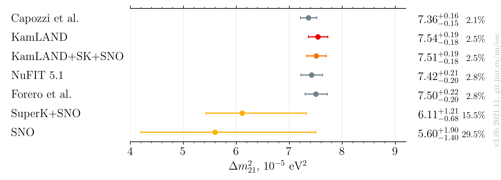
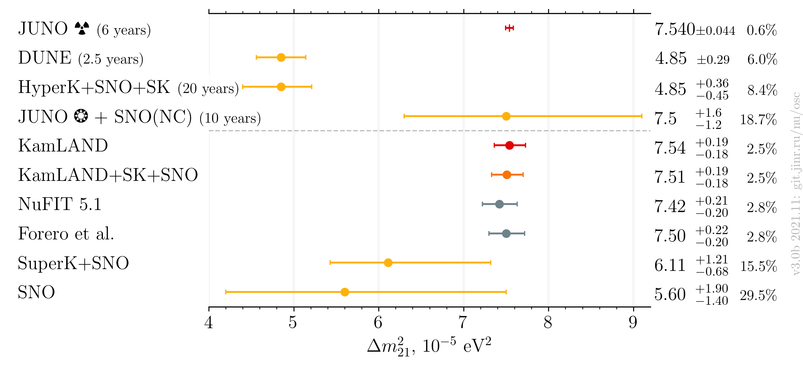

# $`\Delta m^2_{21}`$ measurements comparison, after Neutrino 2020

- Version: **3.0b**
- [Plotting scripts](samples/dm21/dm21-v3.0-future)
- [Data table](dm21_v3-0b.dat)
- References:
    - [KamLAND+SNO+SuperK](data/kamland+sk+sno_2020-07-neutrino2020.yaml)
    - [SNO+SuperK](data/sk+sno_2020-07-neutrino2020.yaml)
    - [KamLAND](data/kamland_2020-07-neutrino2020.yaml)
    - [SNO](data/sno_2020-07-neutrino2020.yaml)
    - [NuFIT 5.0](data/theor_nufit_2020-07-post-neutrino2020.yaml)
    - [Forero et al.](data/theor_forero_2020-06-pre-neutrino2020.yaml)
    - [JUNO] TBD
- Cross checks by:
    * @maxfl
- Notes:
    * Forero et al. is pre-Neutrino fit

| Experiments only         | Including global                | Including global and future            |
|--------------------------|---------------------------------|----------------------------------------|
|  |  |  |

