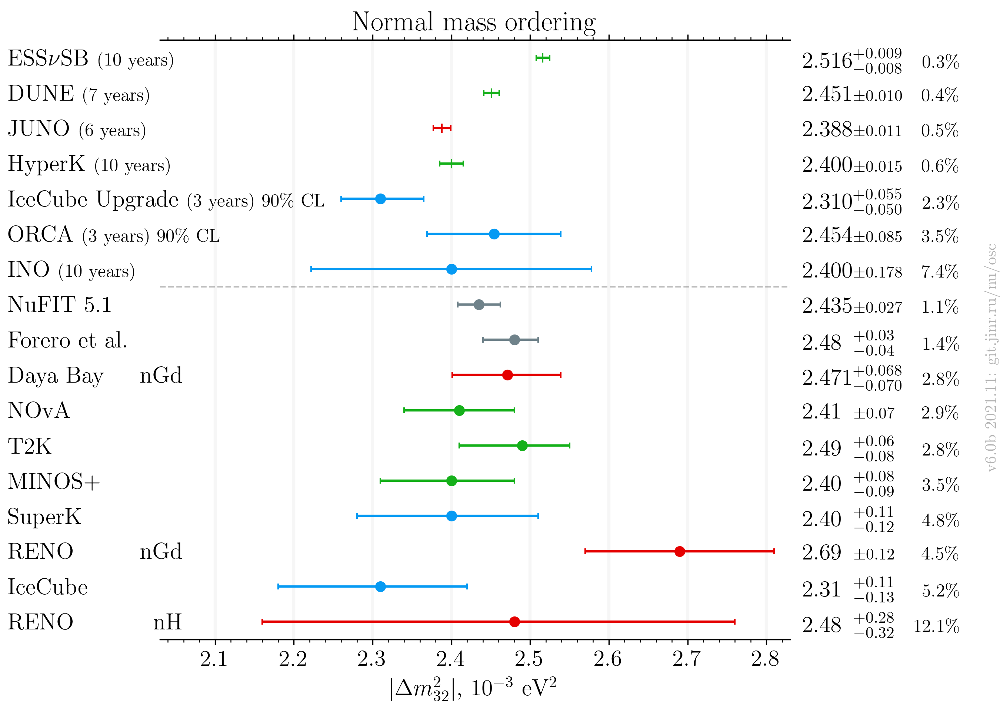
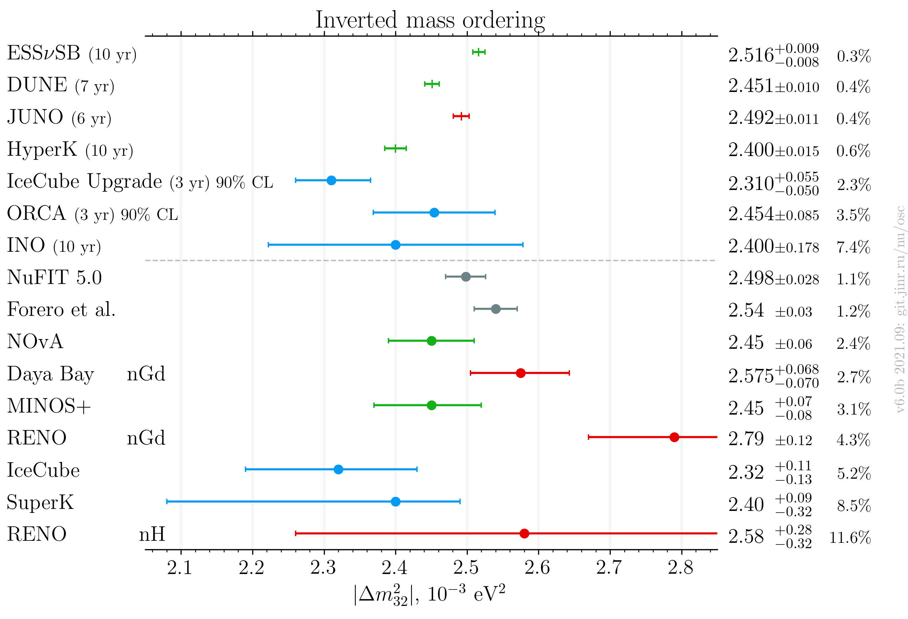
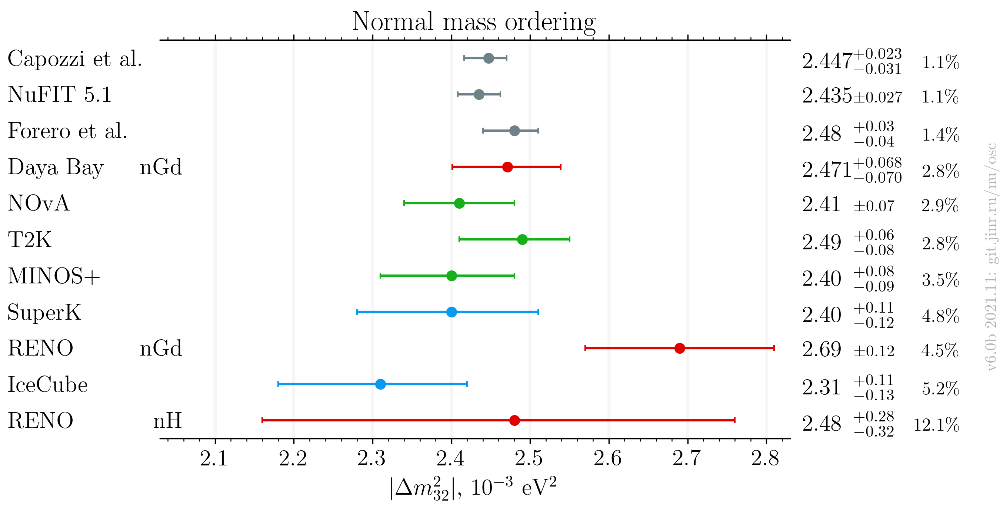
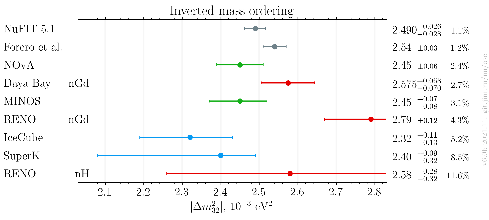
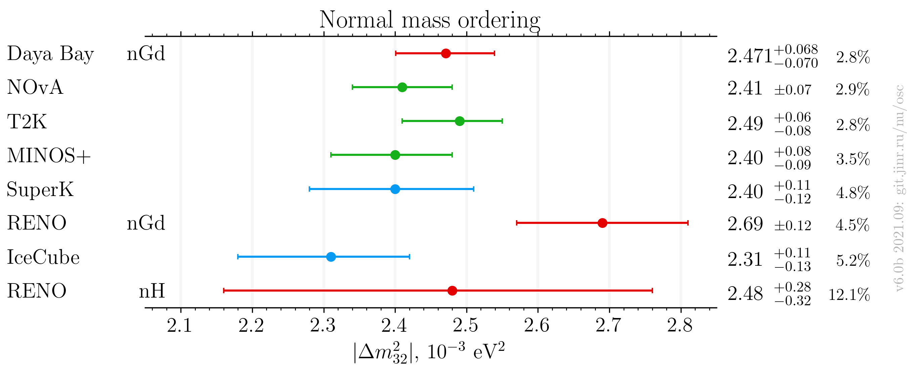
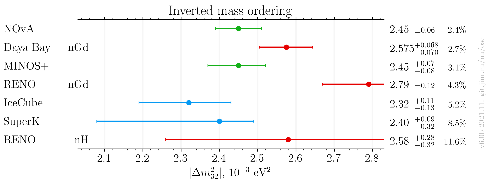

# $`|\Delta m^2_{32}|`$ measurements comparison, updated after Neutrino 2020

- Version: **6.0b**
- Updates since v5.0:
    * Add JUNO estimation
- [Plotting scripts](samples/dm32/dm32-v6.0-future)
- Data tables:
    * [NO table](dm32_NO_v6-0b.dat)
    * [IO table](dm32_IO_v6-0b.dat)
- References:
    * [Daya Bay nGd](data/dayabay_2018-06-neutrino2018.yaml)
    * [RENO](data/reno_2020-07-neutrino2020.yaml)
    * [RENO nH](data/reno_2018-06-neutrino2018.yaml)
    * [NOvA](data/nova_2020-07-neutrino2020.yaml)
    * [T2K](data/t2k_2020-07-neutrino2020.yaml)
    * [MINOS](data/minos_2020-07-neutrino2020.yaml)
    * [IceCube](data/icecube_2020-07-neutrino2020.yaml)
    * [SuperK](data/superk_2020-07-neutrino2020.yaml)
    * [NuFIT 5.0](data/theor_nufit_2020-07-post-neutrino2020.yaml)
    * [Forero et al.](data/theor_forero_2020-06-pre-neutrino2020.yaml)
    * [JUNO Yellow Book](data/juno_future_2015-07-reactor.yaml)
- Conversions:
    * Effective mass splitting $`|\Delta m^2_\mathrm{ee}|`$ conversion (RENO):
        + $`|\Delta m^2_{32}| = |\Delta m^2_\mathrm{ee}| - \alpha \cos^2\theta_{12} \Delta m^2_{21}`$.
    * $`|\Delta m^2_\mathrm{31}|`$ to $`|\Delta m^2_\mathrm{32}|`$ conversion:
        + $`|\Delta m^2_{32}| = |\Delta m^2_\mathrm{31}| - \alpha |\Delta m^2_\mathrm{21}| `$.
    * $`\alpha`$ is +1/-1 for NO/IO.
    * PDG 2020 values:
        + $`\sin^2\theta_{12} = 0.307`$
        + $`\Delta m^2_{21} = 7.53\cdot10^{-5}\text{ eV}^2`$
    * Asymmetric syst/stat errors conversion: quadratically sum left and right part of each (stat/syst) contribution independently
- Cross checks by:
    * @ldkolupaeva
    * Bedrich Roskovec
    * @maxfl
- Notes:
    * Forero et al. is pre-Neutrino fit

## Including global analyses and future experiments

## Including global analyses

## Experiments only

