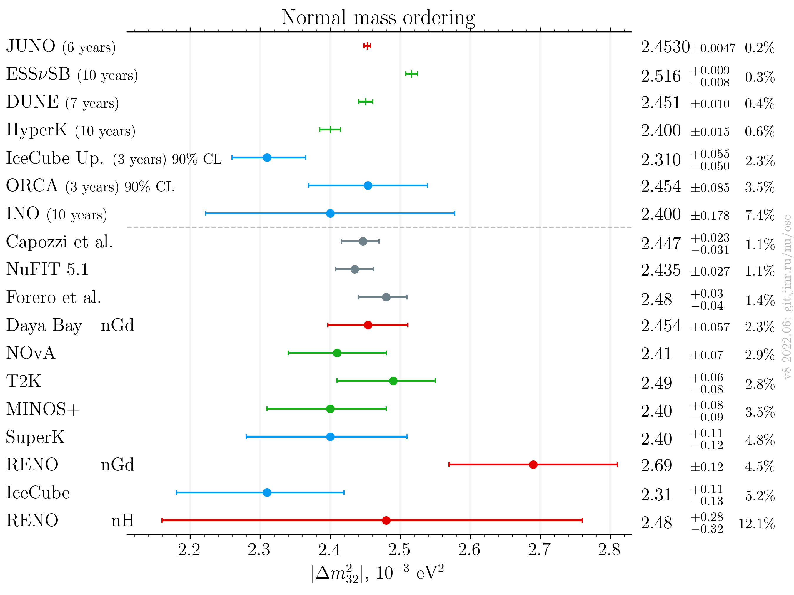
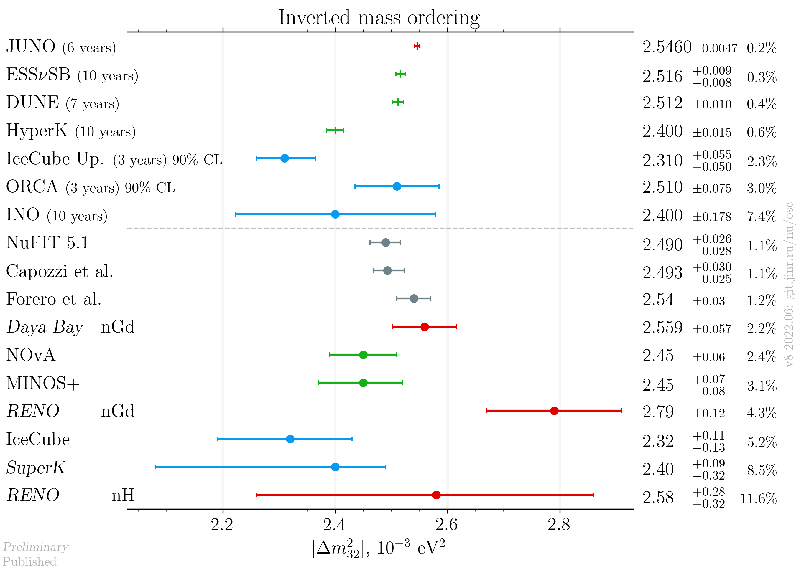
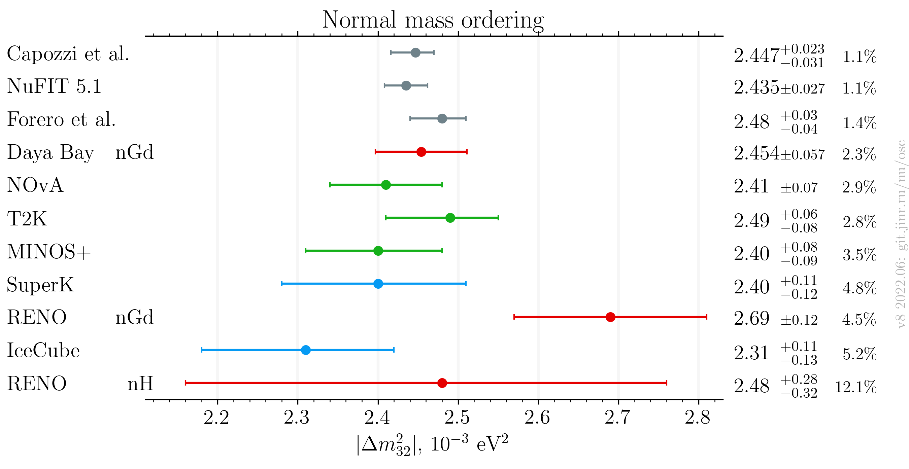
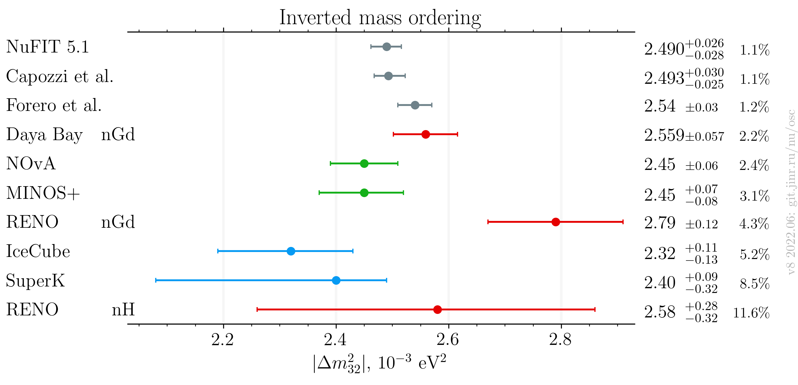
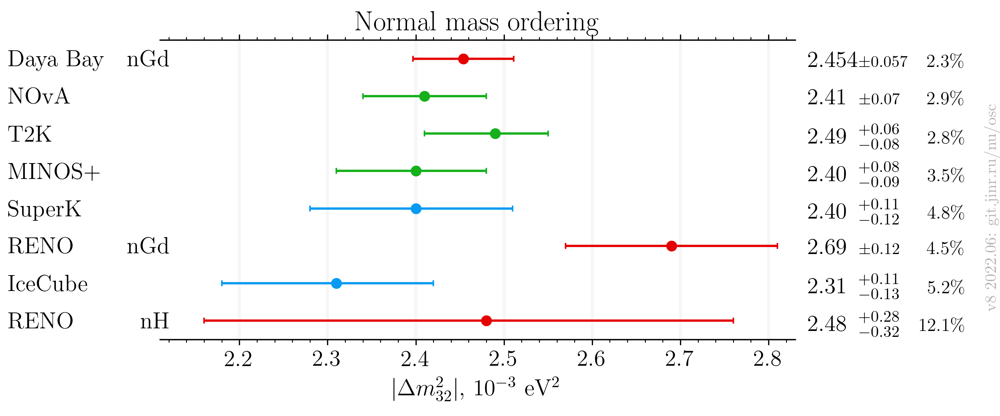
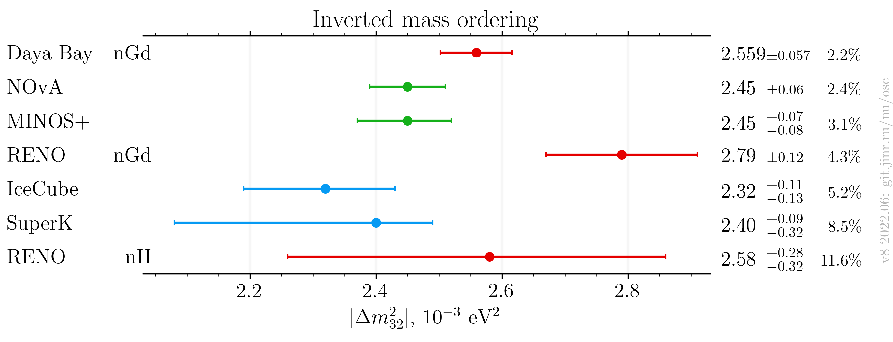

# DRAFT: $`|\Delta m^2_{32}|`$ measurements comparison

- Version: **8b**
- Updates since v7:
    * Add latest Daya Bay measurement
    * Add latest JUNO estimation
    * Add a version with published only results
    * DUNE and ORCA: add distinct IO values
- [Plotting scripts](samples/dm32/dm32-v8-neutrino2022)
- Data tables:
    * [NO published](dm32_v8b_NO_published.dat)
    * [IO published](dm32_v8b_IO_published.dat)
    * [NO latest](dm32_v8b_NO_latest.dat)
    * [IO latest](dm32_v8b_IO_latest.dat)
- Conversions:
    * Effective mass splitting $`|\Delta m^2_\mathrm{ee}|`$ conversion (RENO):
        + $`|\Delta m^2_{32}| = |\Delta m^2_\mathrm{ee}| - \alpha \cos^2\theta_{12} \Delta m^2_{21}`$.
    * $`|\Delta m^2_\mathrm{31}|`$ to $`|\Delta m^2_\mathrm{32}|`$ conversion:
        + $`|\Delta m^2_{32}| = |\Delta m^2_\mathrm{31}| - \alpha |\Delta m^2_\mathrm{21}|`$.
    * $`\alpha`$ is +1/-1 for NO/IO.
    * PDG 2020 values:
        + $`\sin^2\theta_{12} = 0.307`$
        + $`\Delta m^2_{21} = 7.53\cdot10^{-5}\text{ eV}^2`$
    * Asymmetric syst/stat errors conversion: quadratically sum left and right part of each (stat/syst) contribution independently
- Cross checks by:
    * @ldkolupaeva
    * Bedrich Roskovec
    * @maxfl
- Notes:
    * Forero et al. is pre-Neutrino fit

## Latest results

### Including global analyses and future experiments

### Including global analyses

### Experiments only

## References

| Measurement    |                                                   Published |                                                  Latest |                                                                 Both |
|----------------|------------------------------------------------------------:|--------------------------------------------------------:|---------------------------------------------------------------------:|
| Capozzi et al. |                                                             |                                                         |                 [hep-ph/2107.00532](data/theor_capozzi_2021-07.yaml) |
| DUNE           |                                                             |                                                         |                  [hep-ex/2006.16043](data/dune_future_2020_acc.yaml) |
| Daya Bay nGd   | [hep-ex/1809.02261](data/dayabay_2018-06-neutrino2018.yaml) | [Neutrino 2022](data/dayabay_2022-06-neutrino2022.yaml) |                                                                      |
| ESSνSB         |                                                             |                                                         |                       [hep-ex/2107.07585](data/ess_future_2021.yaml) |
| Forero et al.  |                                                             |                                                         | [hep-ph/2006.11237](data/theor_forero_2020-06-pre-neutrino2020.yaml) |
| HyperK         |                                                             |                                                         |            [hep-ex/1805.04163](data/hyperk_future_2018_acc_atm.yaml) |
| IceCube        |                                                             |                                                         |          [hep-ex/1707.07081](data/icecube_2020-07-neutrino2020.yaml) |
| IceCube future |                                                             |                                                         |                   [hep-ex/1911.06745](data/icecube_future_2019.yaml) |
| INO            |                                                             |                                                         |              [physics.ins-det/1505.07380](data/ino_future_2015.yaml) |
| JUNO           |                                                             |                                                         |           [hep-ex/2204.13249](data/juno_future_2022-04-reactor.yaml) |
| MINOS+         |                                                             |                                                         |            [hep-ex/2006.15208](data/minos_2020-07-neutrino2020.yaml) |
| NOvA           |                                                             |                                                         |             [hep-ex/2108.08219](data/nova_2020-07-neutrino2020.yaml) |
| NuFIT 5.0      |                                                             |                                                         |         [NuFIT 5.0](data/theor_nufit_2020-07-post-neutrino2020.yaml) |
| ORCA           |                                                             |                                                         |                      [hep-ex/2103.09885](data/orca_future_2021.yaml) |
| RENO           |                 [hep-ex/1806.00248](data/reno_2018-06.yaml) |    [Neutrino 2020](data/reno_2020-07-neutrino2020.yaml) |                                                                      |
| SuperK         |               [hep-ex/1901.03230](data/superk_2019-01.yaml) |  [Neutrino 2020](data/superk_2020-07-neutrino2020.yaml) |                                                                      |
| T2K            |                  [hep-ex/2101.03779](data/t2k_2021-01.yaml) |     [Neutrino 2020](data/t2k_2020-07-neutrino2020.yaml) |                                                                      |

