# |Δm²₃₂|/|Δm²₃₁| measurements comparison

- Version: **18a**
- Updates since v17:
    * Add JUNO Neutrino 2026 result
- [Plotting scripts](samples/dm32/dm32-v18a-none)
- Conversions:
    * Effective mass splitting $`|\Delta m^2_\mathrm{ee}|`$ conversion (RENO):
        + $`|\Delta m^2_{31}| = |\Delta m^2_\mathrm{ee}| + \alpha \sin^2\theta_{12} \Delta m^2_{21}`$.
        + $`|\Delta m^2_{32}| = |\Delta m^2_\mathrm{ee}| - \alpha \cos^2\theta_{12} \Delta m^2_{21}`$.
    * $`|\Delta m^2_\mathrm{31}|`$ to $`|\Delta m^2_\mathrm{32}|`$ conversion:
        + $`|\Delta m^2_{32}| = |\Delta m^2_\mathrm{31}| - \alpha |\Delta m^2_\mathrm{21}|`$.
    * $`\alpha`$ is +1/-1 for NO/IO.
    * PDG 2020 values:
        + $`\sin^2\theta_{12} = 0.307`$
        + $`\Delta m^2_{21} = 7.53\cdot10^{-5}\text{ eV}^2`$
    * Asymmetric syst/stat errors conversion: quadratically sum left and right part of each (stat/syst) contribution independently
- Cross checks by:
    * @ldkolupaeva
    * @maxfl
- Notes:
    * de Salas et al. and Capozzi et al. are pre-Neutrino 2024 fits
    * [IceCube](data/icecube_2024-05.yaml): NO value and uncertainty are used for the IO

[TOC]

## Latest results

### |Δm²₃₂|

#### Experiments only

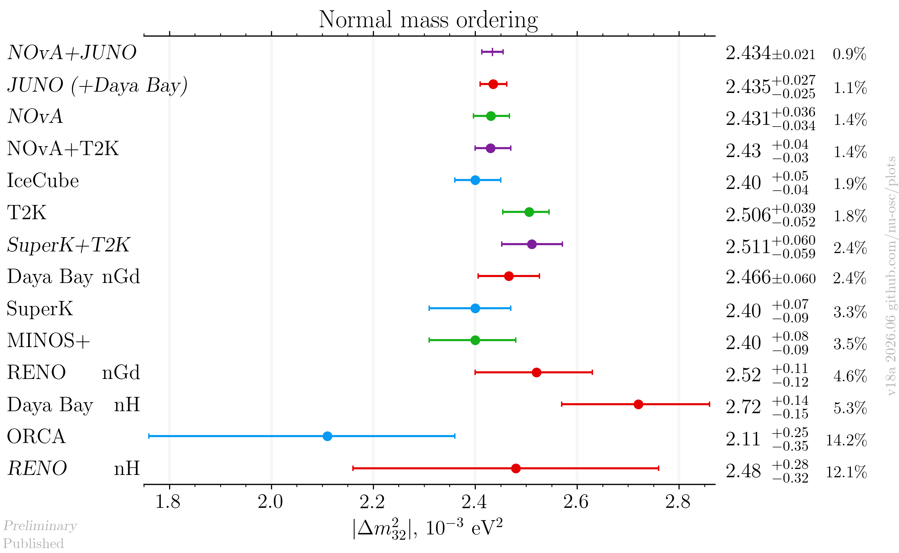

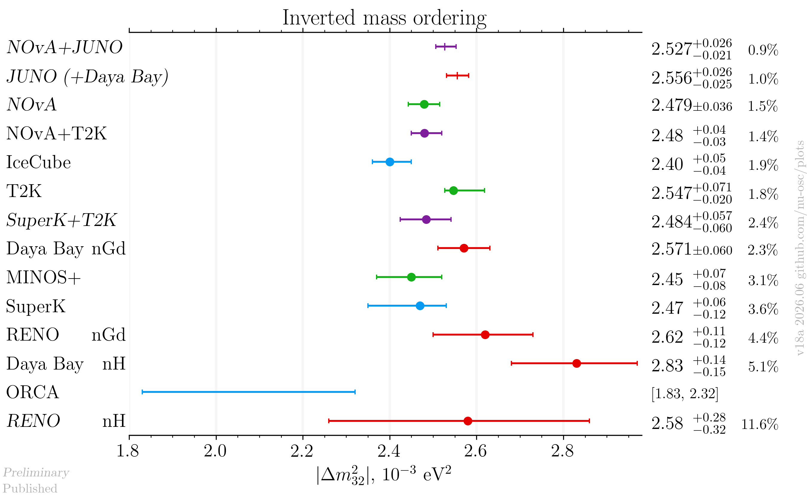

#### Including global analyses

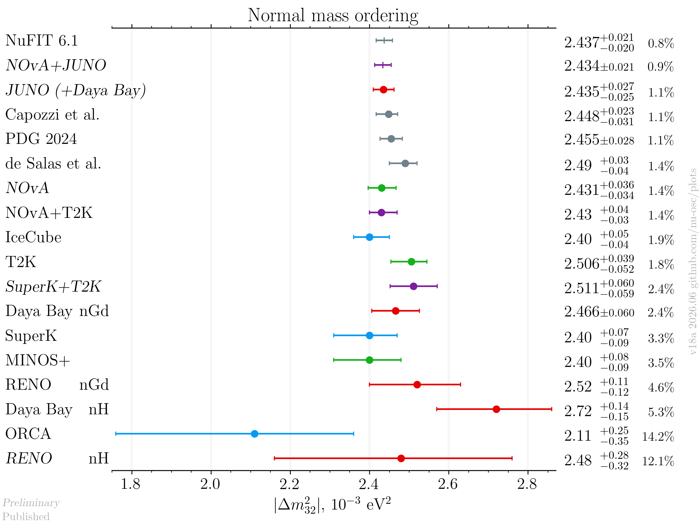

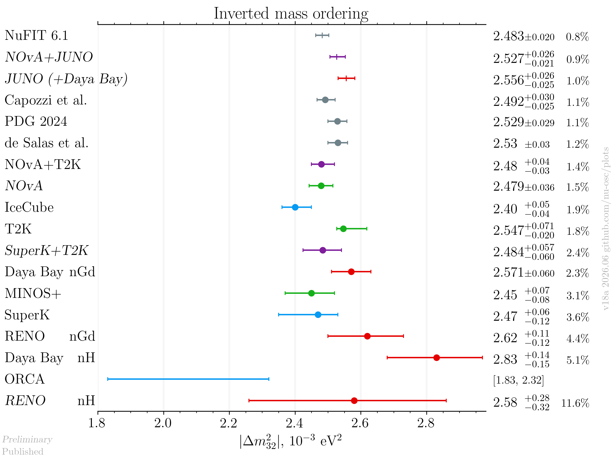

#### Including global analyses and future experiments

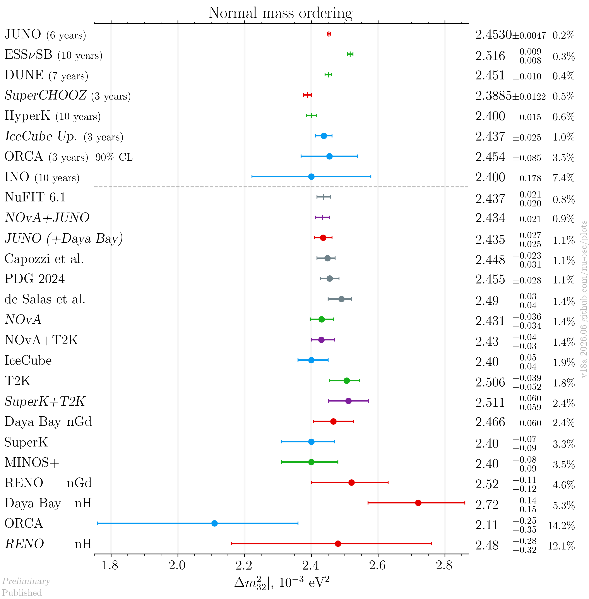

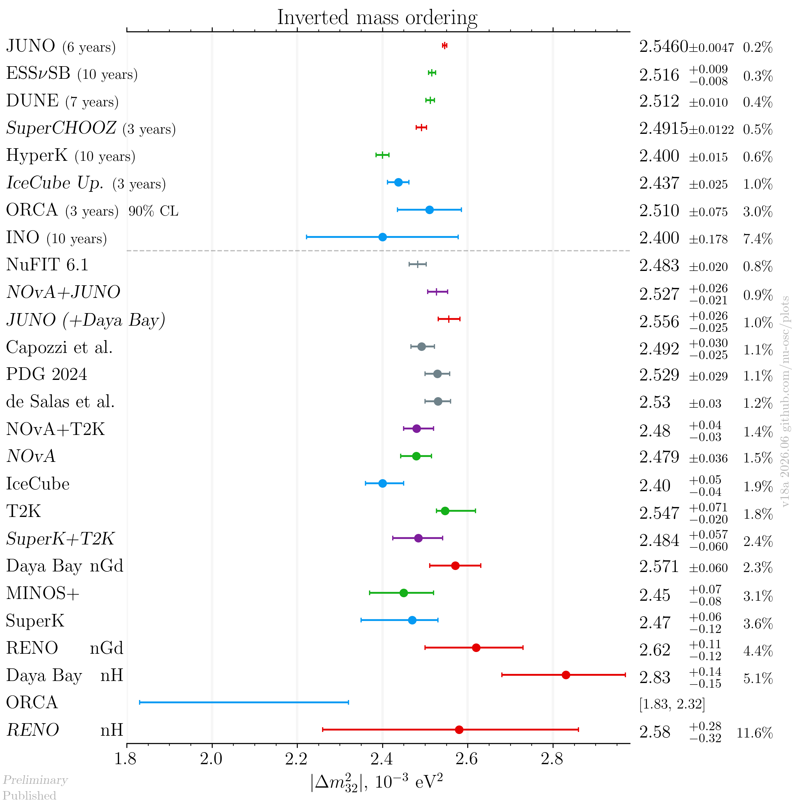

### |Δm²₃₁|

#### Experiments only

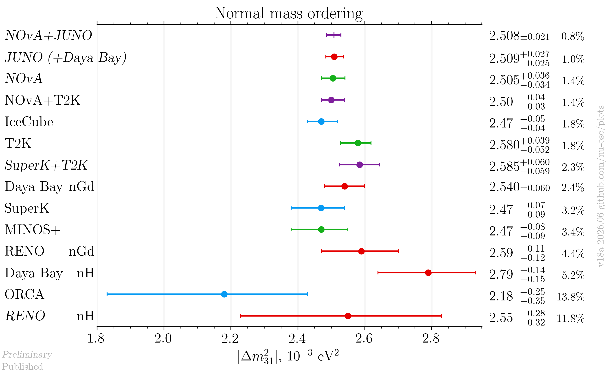

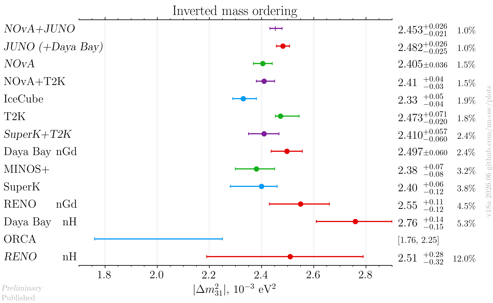

#### Including global analyses

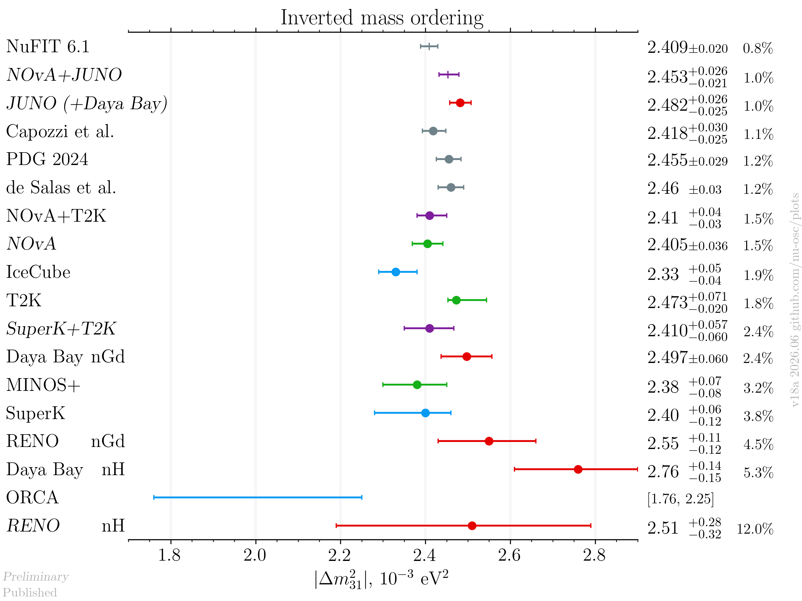

#### Including global analyses and future experiments

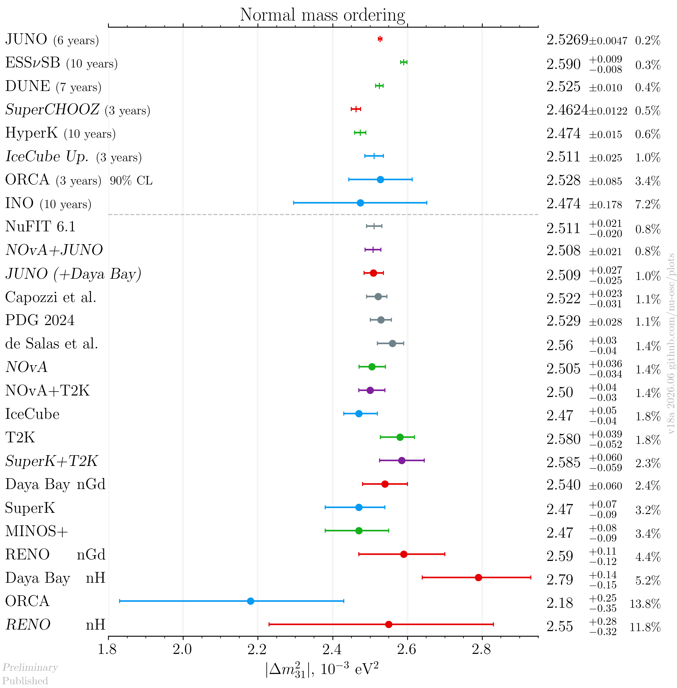

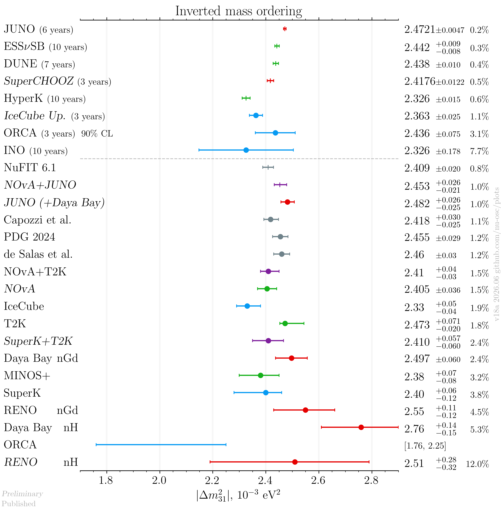

## References

| Measurement         |                                                            Published |                                                     Latest |
|---------------------|---------------------------------------------------------------------:|-----------------------------------------------------------:|
| Capozzi et al.      |                 [hep-ph/2107.00532](data/theor_capozzi_2021-07.yaml) |                                                            |
| DUNE                |                  [hep-ex/2006.16043](data/dune_future_2020_acc.yaml) |                                                            |
| Daya Bay nGd        |                   [hep-ex/2211.14988](data/dayabay_2022-11-nGd.yaml) |                                                            |
| Daya Bay nH         |                    [hep-ex/2406.01007](data/dayabay_2024-06-nH.yaml) |                                                            |
| ESSνSB              |                       [hep-ex/2107.07585](data/ess_future_2021.yaml) |                                                            |
| de Salas et al.     | [hep-ph/2006.11237](data/theor_forero_2020-06-pre-neutrino2020.yaml) |                                                            |
| HyperK              |            [hep-ex/1805.04163](data/hyperk_future_2018_acc_atm.yaml) |                                                            |
| IceCube             |                       [hep-ex/2405.02163](data/icecube_2024-05.yaml) |                                                            |
| IceCube sensitivity |                   [hep-ex/1911.06745](data/icecube_future_2019.yaml) |      [hep-ex/2509.13066](data/icecube_future_2025-09.yaml) |
| INO                 |              [physics.ins-det/1505.07380](data/ino_future_2015.yaml) |                                                            |
| JUNO                |                                                                      |       [Neutrino 2026](data/juno_2026-06_neutrino2026.yaml) |
| JUNO sensitivity    |           [hep-ex/2204.13249](data/juno_future_2022-04-reactor.yaml) |                                                            |
| MINOS+              |            [hep-ex/2006.15208](data/minos_2020-07-neutrino2020.yaml) |                                                            |
| NOvA                |             [hep-ex/2108.08219](data/nova_2020-07-neutrino2020.yaml) |                [hep-ex/2509.04361](data/nova_2025-09.yaml) |
| NOvA+T2K            |                         [hep-ex/2510.19888](data/nova_t2k_2025.yaml) |                                                            |
| NuFIT 6.1           |                       [NuFIT 6.1](data/theor_nufit_6-1_2025-12.yaml) |                                                            |
| PDG                 |                                      [PDG](data/theor_pdg_2024.yaml) |                                                            |
| ORCA                |                          [hep-ex/2408.07015](data/orca_2024-08.yaml) |                                                            |
| ORCA sensitivity    |                      [hep-ex/2103.09885](data/orca_future_2021.yaml) |                                                            |
| RENO nGd            |                 [hep-ex/2412.18711](data/reno_2024-12-nGd-full.yaml) |                                                            |
| SuperCHOOZ          |                                                                      | [CERN seminar 2022](https://indico.cern.ch/event/1215214/) |
| SuperK              |              [hep-ex/2311.05105](data/superk_2023-011_prd.yaml.yaml) |                                                            |
| T2K                 |                           [hep-ex/2303.03222](data/t2k_2023_03.yaml) | [Neutrino 2024](data_latest/t2k_2024-06-neutrino2024.yaml) |
