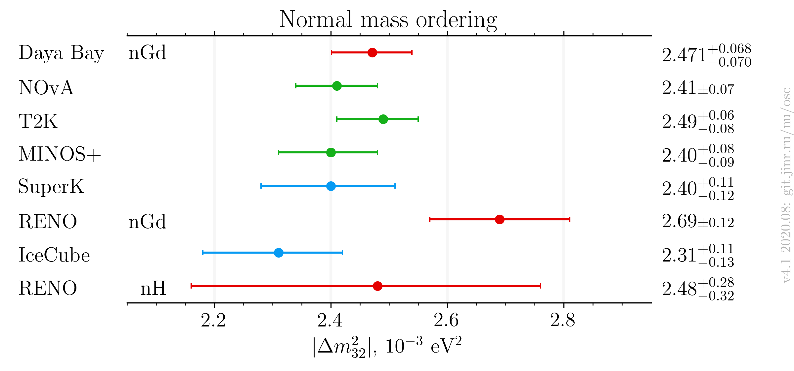
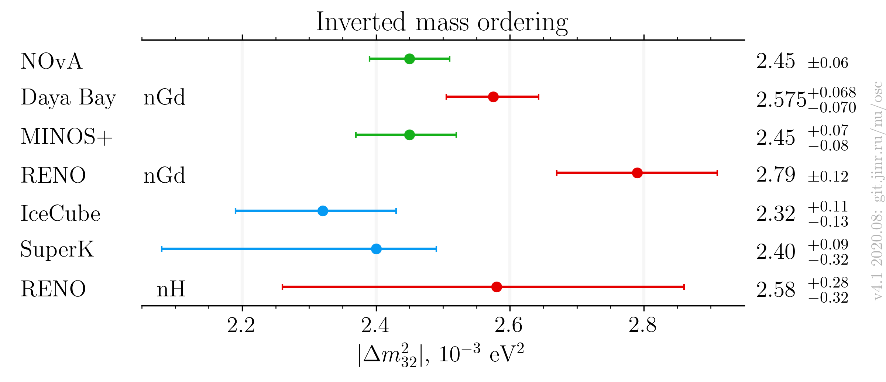
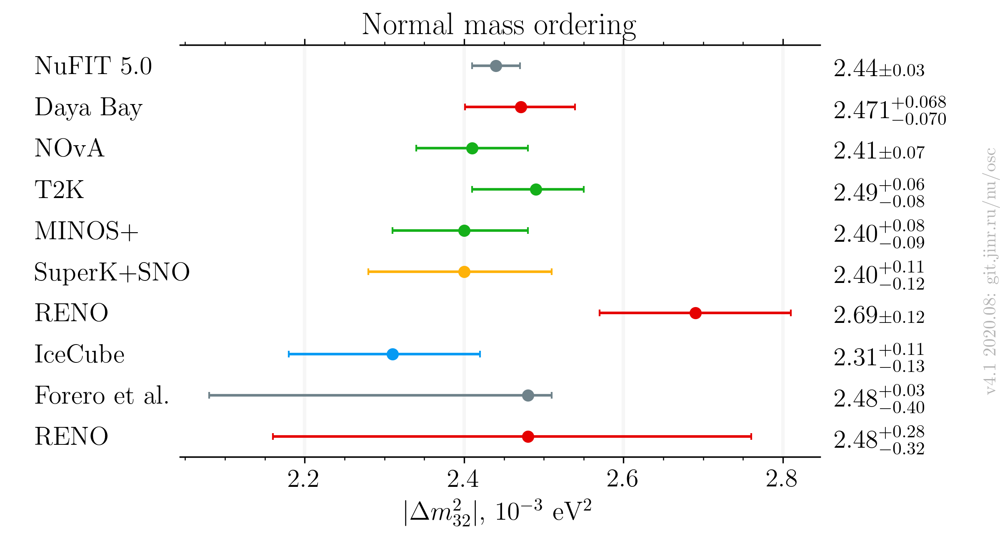
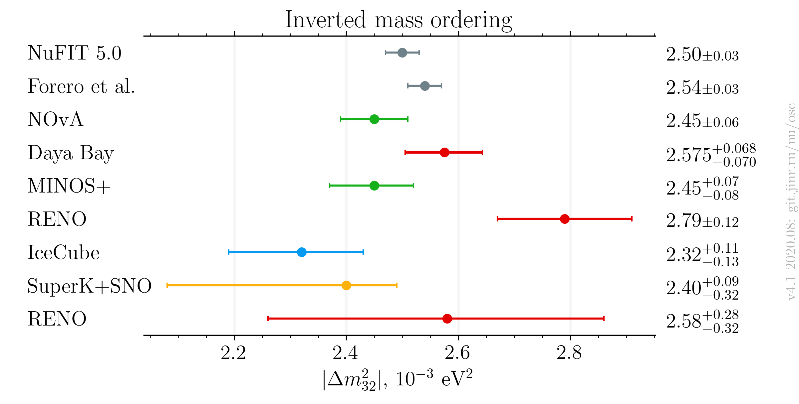

# :warning: This is a beta version of the plot. Use it at your own risk.

# $`|\Delta m^2_{32}|`$ measurements comparison, updated after Neutrino 2020

- Version: 4.1
- Updates since v4.0:
    * Added global measurements
    * Switched to matplotlib plotting instead of latex
- [Plotting scripts](samples/dm32/v4.1-neutrino2020)
- Data tables:
    * [NO table](dm32_NO_v4-1.dat)
    * [IO table](dm32_IO_v4-1.dat)
- References:
    * [Daya Bay nGd](data/dayabay_2018-06-neutrino2018.yaml)
    * [RENO](data/reno_2020-07-neutrino2020.yaml)
    * [RENO nH](data/reno_2018-06-neutrino2018.yaml)
    * [T2K](data/t2k_2020-07-neutrino2020.yaml)
    * [MINOS](data/minos_2020-07-neutrino2020.yaml)
    * [IceCube](data/icecube_2020-07-neutrino2020.yaml)
    * [SuperK](data/superk_2020-07-neutrino2020.yaml)
    * [NuFIT 5.0](data/theor_nufit_2020-07-post-neutrino2020.yaml)
    * [Forero et al.](data/theor_forero_2020-06-pre-neutrino2020.yaml)
- Conversions:
    * Effective mass splitting $`|\Delta m^2_\mathrm{ee}|`$ conversion (RENO):
        + $`|\Delta m^2_{32}| = |\Delta m^2_\mathrm{ee}| - \alpha \cos^2\theta_{12} \Delta m^2_{21}`$, where $`\alpha`$ is +1/-1 for NO/IO.
        + PDG 2020 values:
            + $`\sin^2\theta_{13} = 0.307`$
            + $`\Delta m^2_{21} = 7.53\cdot10^{-5}\text{ eV}^2`$
    * Asymmetric syst/stat errors conversion: quadratically sum left and right part of each (stat/syst) contribution independently
- Cross checks by:
    * @ldkolupaeva
    * Beda
- Notes:
    * Forero et al. is pre-Neutrino fit

|                  | Normal ordering                          | Inverted Ordering                    |
|------------------|------------------------------------------|--------------------------------------|
| Experiments only |         |         |
| Including global |  |  |

