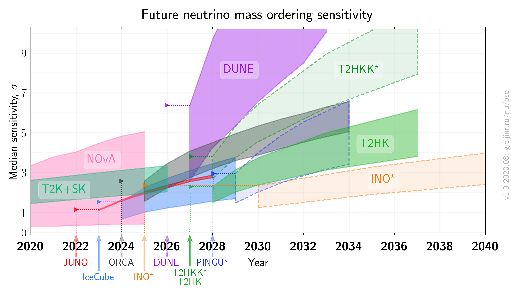

# Neutrino mass order sensitivity for future experiments, after Neutrino 2020

- Version: 1.0
- [Plotting scripts](samples/future_mh/v1.0-neutrino2020)
- References:
    * [T2K+SK](data/future_mh/t2ksk.yaml)
    * [NOvA](data/future_mh/nova.yaml)
    * [JUNO](data/future_mh/juno.yaml)
    * [Ice Cube Upgrade](data/future_mh/icupgr.yaml)
    * [KM3NeT/ORCA](data/future_mh/orca.yaml)
    * [ICAL @ INO](data/future_mh/ino.yaml)
    * [DUNE](data/future_mh/dune.yaml)
    * [T2HK](data/future_mh/t2hk.yaml)
    * [T2HKK](data/future_mh/t2hkk.yaml)
    * [PINGU](data/future_mh/pingu.yaml)
- Cross checks by:

- Notes:
    * INO, T2HKK, PINGU status is unclear (marked with star in the plot), approximate starting years are taken
    * joint beam + atmospheric sensitivity is shown for T2HK and T2HKK here
    * sources for sensitivities vs years for all experiments are written in references

  

