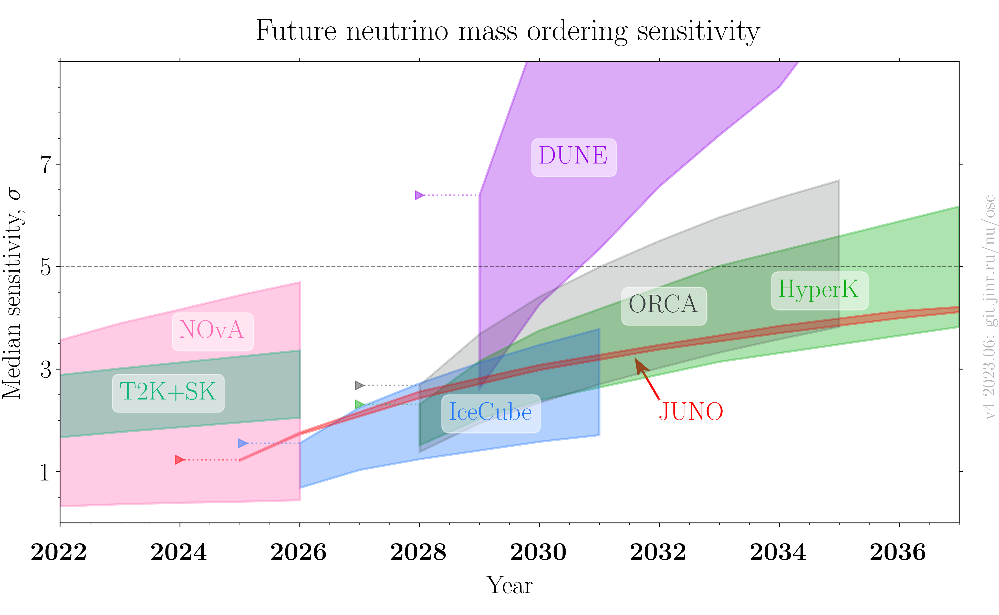

# Neutrino mass order sensitivity for future experiments

- Version: v4.0
- Updates since v3.0:
    * TBD
- [Plotting scripts](samples/future_mo/future_mo-v4.0)
- References:
    * [T2K+SK](data/t2k_superK_future_2019.yaml)
    * [NOvA](data/nova_future_2022.yaml)
    * [JUNO](data/juno_future_2022-reactor.yaml)
    * [Ice Cube Upgrade](data/icecube_future_2019.yaml)
    * [KM3NeT/ORCA](data/orca_future_2021.yaml)
    * [DUNE](data/dune_future_2023_optimistic.yaml)
    * [T2HK](data/hyperk_future_2018_acc_atm.yaml)
    * TBD
- Cross checks by:
    * 
- Notes:
    * Sources for sensitivities vs years for all experiments are written in references
    * Digitizer was used for extracting values from plots

 
