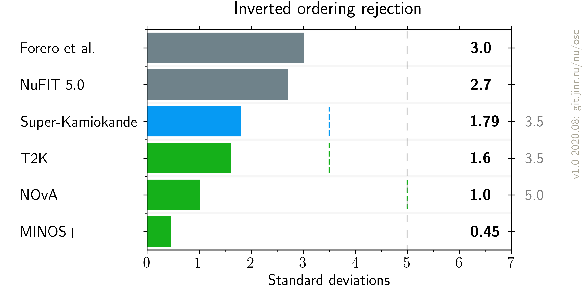

# Neutrino mass order measurements comparison, updated after Neutrino 2020

- Version: 1.0
- [Plotting scripts](samples/mh/v1.0-neutrino2020)
- References:
    * [MINOS+](data/minos_2020-07-neutrino2020.yaml)
    * [T2K](data/t2k_2020-07-neutrino2020.yaml)
    * [SuperK](data/superk_2020-07-neutrino2020.yaml)
    * [NOvA](data/nova_2020-07-neutrino2020.yaml)
    * [NuFIT 5.0](data/theor_nufit_2020-07-post-neutrino2020.yaml)
    * [Forero et al.](data/theor_forero_2020-06-pre-neutrino2020.yaml)
- Cross checks by:

- Notes:
    * Forero et al. is pre-Neutrino version;
    * SuperK sigma is extracted as delta chi2 squared; official statement is 71.4-90.3% CLs disfavor for IH
    * grey MO numbers on right axis are experiment maximal sensitivities

  

