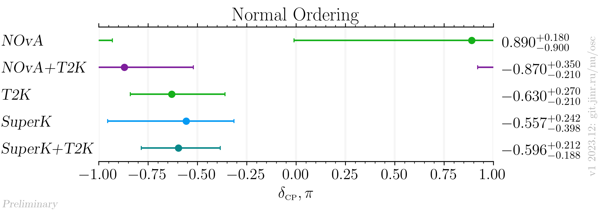
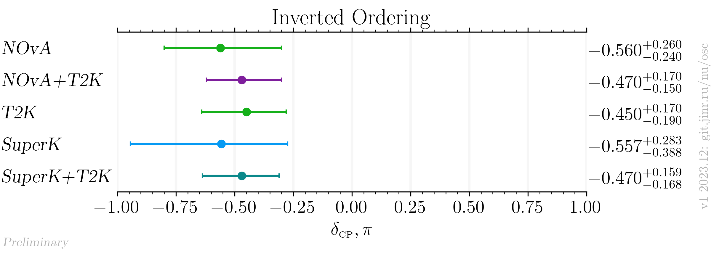

# $`\delta_{\scriptscriptstyle\mathrm{CP}}`$ measurements comparison for the NOvA + T2K joint fit results

- Version: 1
- [Plotting scripts](samples/novat2k_jf_release/deltaCP-special)
- Data tables:
    * [NO table](deltaCP_NO_v2-1.dat)
    * [IO table](deltaCP_IO_v2-1.dat)
- References:
    * [T2K](data/t2k_2020-07-neutrino2020.yaml)
    * [SuperK](data/superk_2020-07-neutrino2020.yaml)
    * [NOvA](data/nova_2020-07-neutrino2020.yaml)
- Cross checks by:
    * @ldkolupaeva
    * @maxfl

| Normal ordering                        | Inverted Ordering                      |
| ---                                    | ---                                    |
|  |  |

