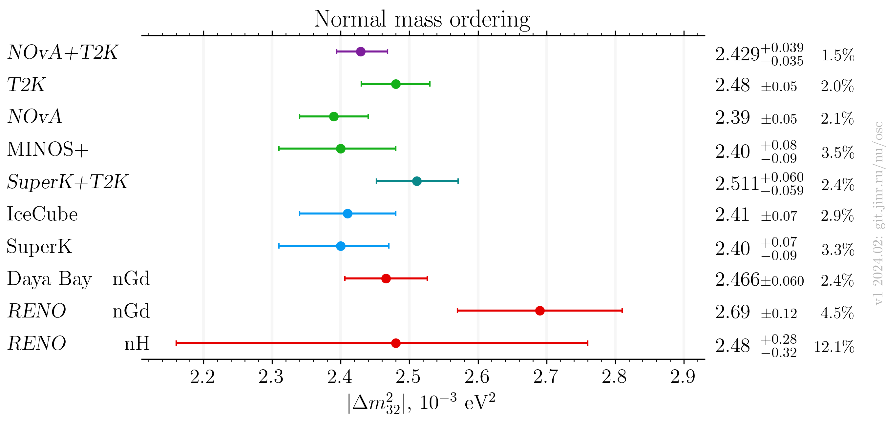
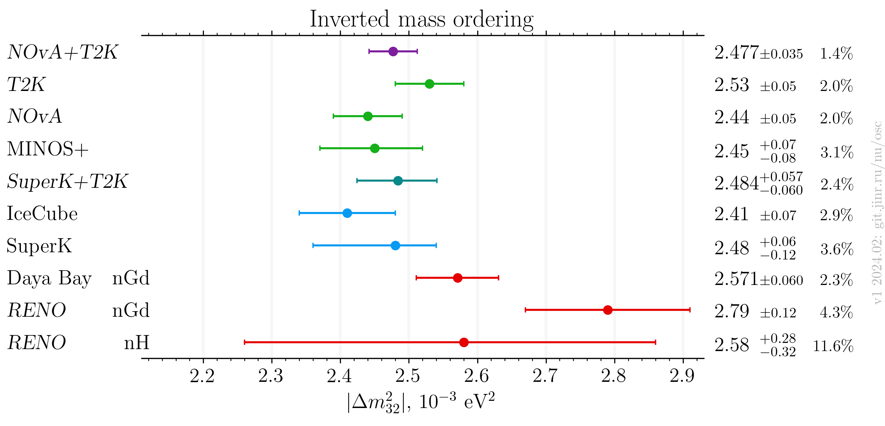

# |Δm²₃₂| measurements comparison for NOvA+T2K result release

- Version: 1
- [Plotting scripts](samples/novat2k_jf_release/dm32-special)
- Conversions:
    * Effective mass splitting $`|\Delta m^2_\mathrm{ee}|`$ conversion (RENO):
        + $`|\Delta m^2_{31}| = |\Delta m^2_\mathrm{ee}| + \alpha \sin^2\theta_{12} \Delta m^2_{21}`$.
        + $`|\Delta m^2_{32}| = |\Delta m^2_\mathrm{ee}| - \alpha \cos^2\theta_{12} \Delta m^2_{21}`$.
    * $`|\Delta m^2_\mathrm{31}|`$ to $`|\Delta m^2_\mathrm{32}|`$ conversion:
        + $`|\Delta m^2_{32}| = |\Delta m^2_\mathrm{31}| - \alpha |\Delta m^2_\mathrm{21}|`$.
    * $`\alpha`$ is +1/-1 for NO/IO.
    * PDG 2020 values:
        + $`\sin^2\theta_{12} = 0.307`$
        + $`\Delta m^2_{21} = 7.53\cdot10^{-5}\text{ eV}^2`$
    * Asymmetric syst/stat errors conversion: quadratically sum left and right part of each (stat/syst) contribution independently
- Cross checks by:
    * @ldkolupaeva
    * @maxfl
- Notes:
    * NOvA and T2K individual results were extracted by the joint fit working group during preparation to the joint fit from individual experiments re-analysis.
    * [IceCube](data/icecube_2023-04.yaml): NO value and uncertainty are used for the IO

## References

| Measurement     |                                                            Reference |
|-----------------|---------------------------------------------------------------------:|
| Daya Bay nGd    |                   [hep-ex/2211.14988](data/dayabay_2022-11-nGd.yaml) | 
| IceCube         |                       [hep-ex/2304.12236](data/icecube_2023-04.yaml) |
| MINOS+          |            [hep-ex/2006.15208](data/minos_2020-07-neutrino2020.yaml) |
| NOvA            |                                         Joint fit working group data |
| RENO            |                 [Neutrino 2020](data/reno_2020-07-neutrino2020.yaml) |
| SuperK          |                        [arXiv:2311.05105](data/superk_2023-011.yaml) |
| T2K             |                                         Joint fit working group data |
| NOvA+T2K        |                                         Joint fit working group data |
| SuperK+T2K      |                                                        talk at NNN23 |

