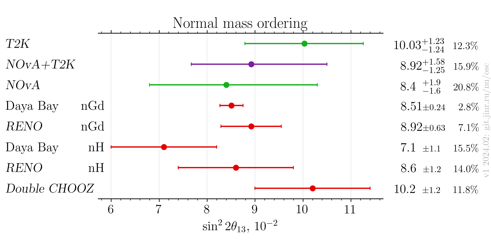
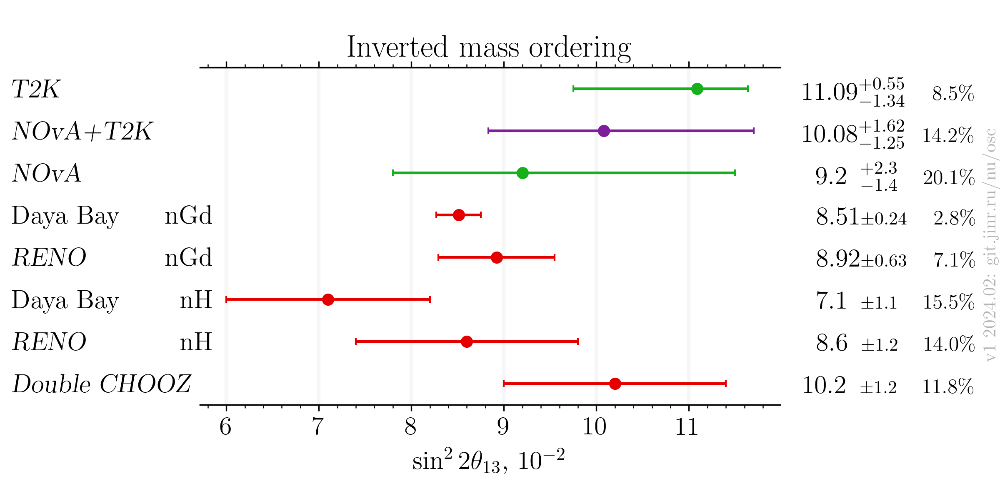

# sin²2θ₁₃ measurements comparison for NOvA+T2K result release

- Version: 1
- [Plotting scripts](samples/novat2k_jf_release/theta13-special)
- Data tables:
    * [NO table](plots/theta13_v1_NO_latest.dat)
    * [IO table](plots/theta13_v1_IO_latest.dat)
- Cross checks by:
    * @ldkolupaeva
    * @maxfl
- Notes:
    * NOvA and T2K individual results were extracted by the joint fit working group during preparation to the joint fit from individual experiments re-analysis.   

## Latest results

## References

| Measurement     |                                                            Reference |
|-----------------|---------------------------------------------------------------------:|
| Daya Bay nGd    |                   [hep-ex/2211.14988](data/dayabay_2022-11-nGd.yaml) |
| Daya Bay nH     |          [hep-ex/1603.03549](data/dayabay_2016-07-neutrino2016.yaml) | 
| NOvA            |                                         Joint fit working group data |
| RENO            |                 [Neutrino 2020](data/reno_2020-07-neutrino2020.yaml) |
| Double CHOOZ    |               [Neutrino 2020](data/dchooz_2020-07-neutrino2020.yaml) |
| T2K             |                                         Joint fit working group data |
| NOvA+T2K        |                                         Joint fit working group data |
