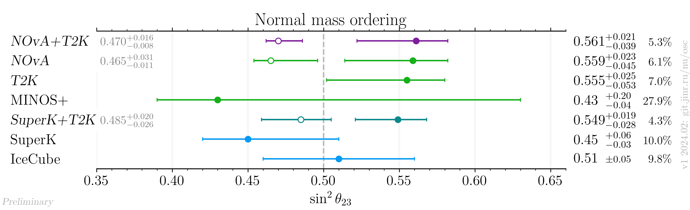
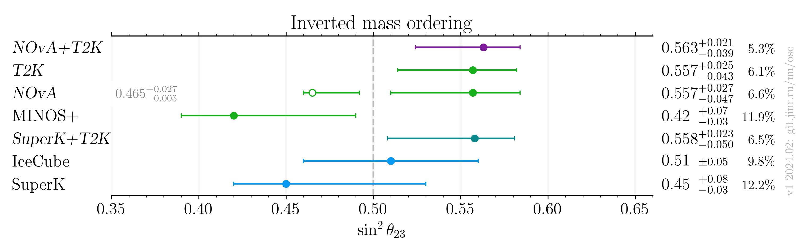

# $`\sin^2 \theta_{23}`$ measurements comparison for NOvA+T2K result release

- Version: 1
- [Plotting scripts](samples/novat2k_jf_release/theta23-special)
- Data tables:
    * [NO table](plots/theta23_v1_NO_latest.dat)
    * [IO table](plots/theta23_v1_IO_latest.dat)
- Notes:
    * NOvA and T2K individual results were extracted by the joint fit working group during preparation to the joint fit from individual experiments re-analysis.
    * [IceCube](data/icecube_2023-04.yaml): NO value and uncertainty are used for the IO
- Cross checks by:
    * @ldkolupaeva
    * @maxfl

## Plots

## References

| Measurement     |                                                            Reference |
|-----------------|---------------------------------------------------------------------:|
| IceCube         |                       [hep-ex/2304.12236](data/icecube_2023-04.yaml) |
| MINOS+          |            [hep-ex/2006.15208](data/minos_2020-07-neutrino2020.yaml) |
| NOvA            |                                         Joint fit working group data |
| SuperK          |                        [arXiv:2311.05105](data/superk_2023-011.yaml) |
| T2K             |                                         Joint fit working group data |
| NOvA+T2K        |                                         Joint fit working group data |
| SuperK+T2K      |                                                        talk at NNN23 |
