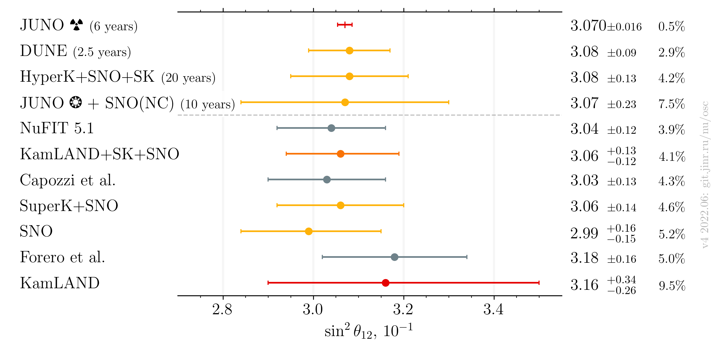
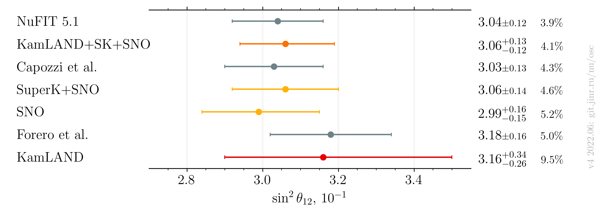
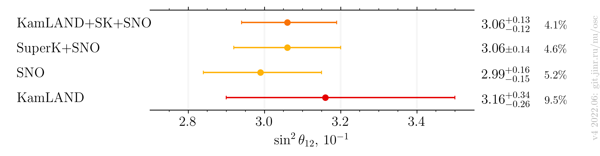

# $`\sin^2 \theta_{12}`$ measurements comparison

- Version: **4b**
- Updates since v3.0:
    * Add latest JUNO estimation
    * Add a version with published only results
- [Plotting scripts](samples/theta12/theta12-v4-juno)
- Data tables:
    * [published](theta12_v4b_published.dat)
    * [latest](theta12_v4b_latest.dat)
- Cross checks by:
    * @ldkolupaeva
    * @maxfl
- Notes:
    * Forero et al. is pre-Neutrino fit
    * $`\tan^2 \theta_{12}`$ to $`\sin^2 \theta_{12}`$ conversion:
        + $`\sin^2 \theta_{12} = 1 - 1/(1+\tan^2 \theta_{12})`$.

## Plots

###  Including global analyses and future experiments

### Including global analyses

### Experiments only

## References

| Measurement        |                                             Published |                                                         Latest |                                                                 Both |
|--------------------|------------------------------------------------------:|---------------------------------------------------------------:|---------------------------------------------------------------------:|
| Capozzi et al.     |                                                       |                                                                |                 [hep-ph/2107.00532](data/theor_capozzi_2021-07.yaml) |
| DUNE               |                                                       |                                                                |                  [hep-ph/1808.08232](data/dune_future_2018_sol.yaml) |
| Forero et al.      |                                                       |                                                                | [hep-ph/2006.11237](data/theor_forero_2020-06-pre-neutrino2020.yaml) |
| HyperK             |                                                       |                  [ICHEP2020](data/hyperk_future_2020_sol.yaml) |                                                                      |
| JUNO               |                                                       |                                                                |           [hep-ex/2204.13249](data/juno_future_2022-04-reactor.yaml) |
| KamLAND            |                                                       |                                                                |          [hep-ex/1606.07538](data/kamland_2020-07-neutrino2020.yaml) |
| NuFIT 5.0          |                                                       |                                                                |         [NuFit 5.0](data/theor_nufit_2020-07-post-neutrino2020.yaml) |
| SNO                |                                                       |                                                                |               [hep-ex/1109.0763](data/sno_2020-07-neutrino2020.yaml) |
| SuperK+SNO         |         [hep-ex/1606.07538](data/sk+sno_2016-06.yaml) |         [Neutrino 2020](data/sk+sno_2020-07-neutrino2020.yaml) |                                                                      |
| SuperK+SNO+KamLAND | [hep-ex/1606.07538](data/kamland+sk+sno_2016-06.yaml) | [Neutrino 2020](data/kamland+sk+sno_2020-07-neutrino2020.yaml) |                                                                      |
