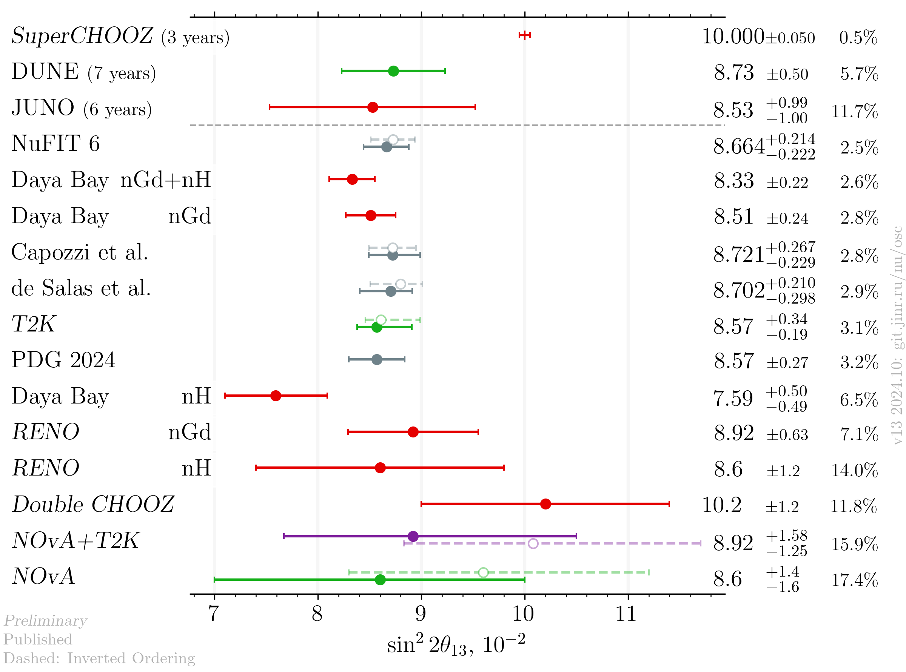
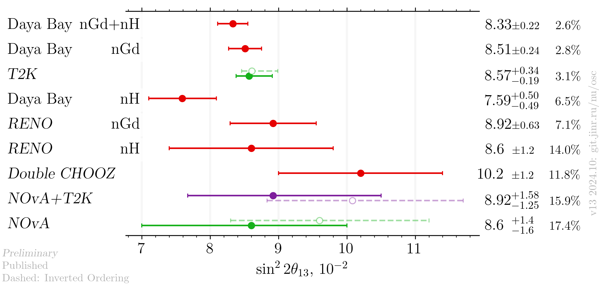
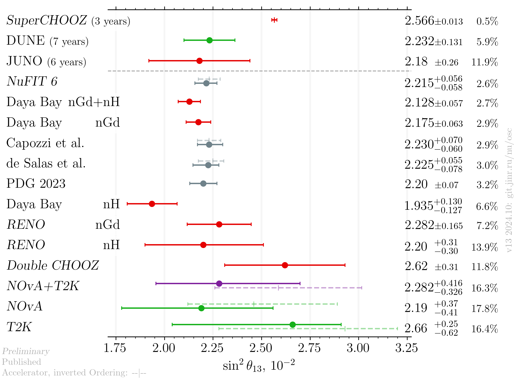
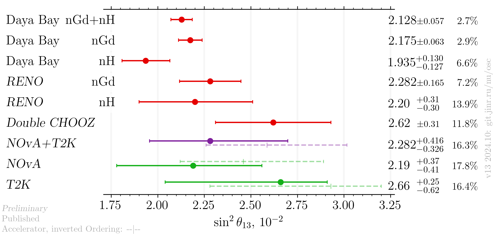

# sin²2θ₁₃ (sin²θ₁₃) measurements comparison

- Version: **13**
- Updates since v12:
    * Daya Bay results are now published
    * Latest RENO results
- [Plotting scripts](samples/theta13/theta13-v13-)
- Data tables:
    * [published](theta13_v13_published.dat)
    * [latest](theta13_v13_latest.dat)
- Cross checks by:
    * @ldkolupaeva
    * @maxfl
- Notes:
    * Forero et al. is pre-Neutrino fit
    * dashed grey bar in theoretical entry means IO
    * only a few plots are shown below, see the subfolders for all the available plots

## Latest results

### sin²2θ₁₃

####  Including global analyses and future experiments

#### Experiments only

### sin²θ₁₃

####  Including global analyses and future experiments

#### Experiments only

## References

| Measurement     |                                                            Published |                                                      Latest |
|-----------------|---------------------------------------------------------------------:|------------------------------------------------------------:|
| Capozzi et al.  |                 [hep-ph/2107.00532](data/theor_capozzi_2021-07.yaml) |                                                             |
| DUNE            |                  [hep-ex/2006.16043](data/dune_future_2020_acc.yaml) |                                                             |
| Daya Bay nGd    |                   [hep-ex/2211.14988](data/dayabay_2022-11-nGd.yaml) |                                                             |
| Daya Bay nH     |                    [hep-ex/2406.01007](data/dayabay_2024-06-nH.yaml) |                                                             |
| Double CHOOZ    |                        [hep-ex/1901.09445](data/dchooz_2019-01.yaml) |      [Neutrino 2020](data/dchooz_2020-07-neutrino2020.yaml) |
| de Salas et al. | [hep-ph/2006.11237](data/theor_forero_2020-06-pre-neutrino2020.yaml) |                                                             |
| JUNO            |           [hep-ex/2204.13249](data/juno_future_2022-04-reactor.yaml) |                                                             |
| NOvA            |                                                                      | [Joint fit working group data](data/updated_nova_2023.yaml) |
| NOvA+T2K        |                                                                      |  [Joint fit working group data](data/nova_t2k_jf_2023.yaml) |
| NuFIT           |                       [NuFIT 5.2](data/theor_nufit_5_2_2022-11.yaml) |                  [NuFIT 6](data/theor_nufit_6_2024-10.yaml) |
| PDG             |                                      [PDG](data/theor_pdg_2022.yaml) |                                                             |
| RENO nGd        |                 [hep-ex/2412.18711](data/reno_2024-12-nGd-full.yaml) |                                                             |
| RENO nH         |                       [hep-ex/1911.04601](data/reno_2019-11_nH.yaml) |     [Neutrino 2022](data/reno_2020-06-nH-neutrino2022.yaml) |
| SuperCHOOZ      |                                                                      |  [CERN seminar 2022](data/dchooz_2020-07-neutrino2020.yaml) |
| T2K             |                                                                      |  [Joint fit working group data](data/updated_t2k_2023.yaml) |
