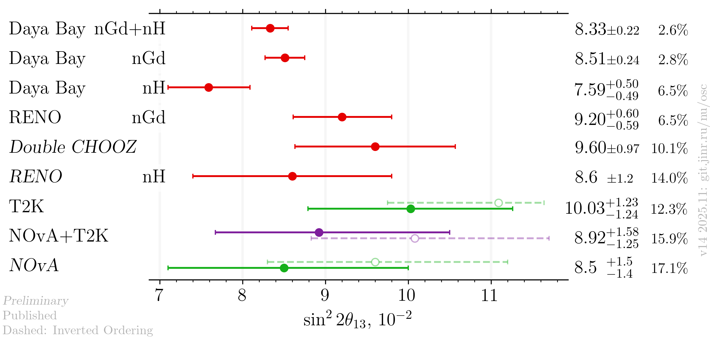
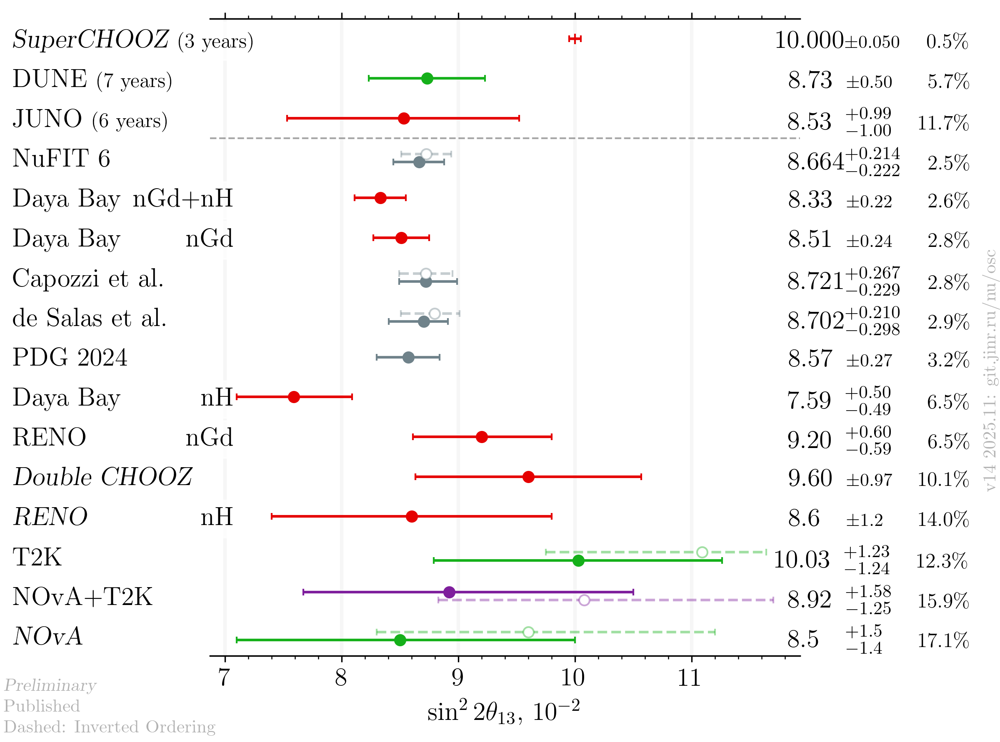
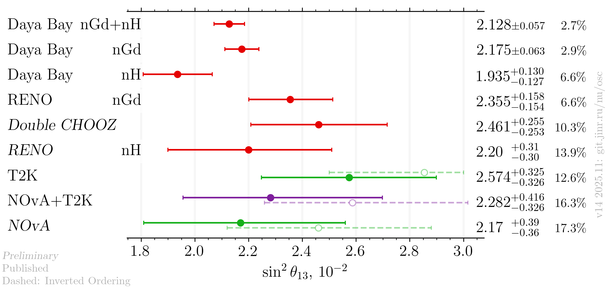
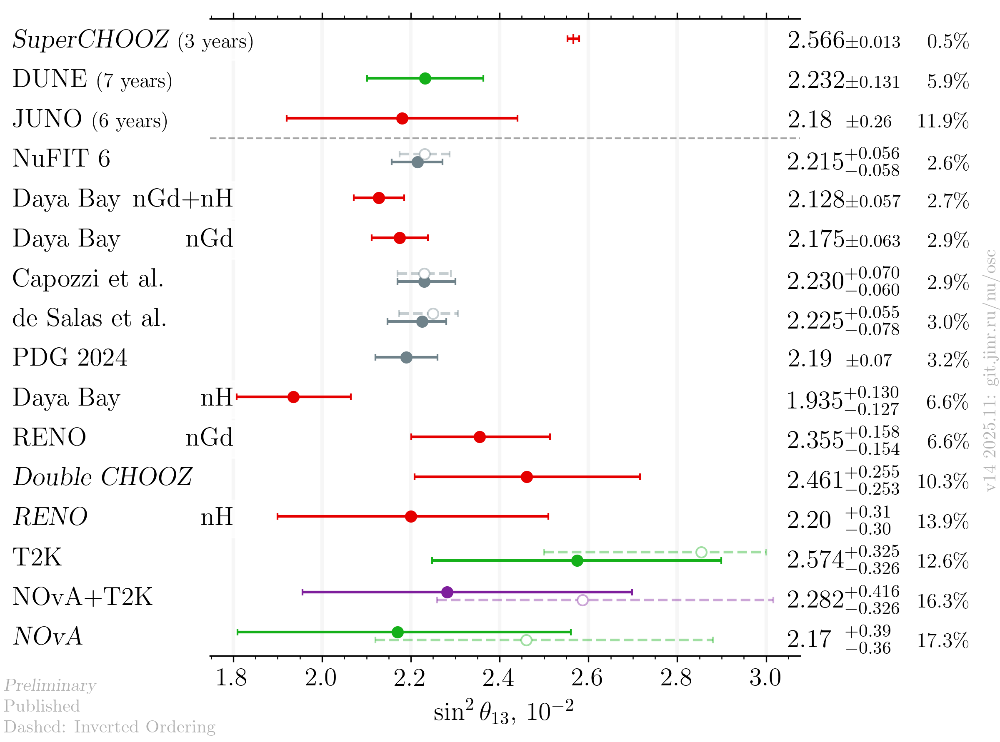

# sin²2θ₁₃ (sin²θ₁₃) measurements comparison

- [Latest results](<plots/Readme.md#latest-results>)
    * [sin²2θ₁₃](<plots/Readme.md#sin%EF%B8%8F2>)
    * [sin²θ₁₃](<plots/Readme.md#sin%EF%B8%8F>)
- [References](<plots/Readme.md#references>)

- Version: **14**
- Updates since v13:
    * Latest Double CHOOZ results from TAUP 2025
    * NOvA preprint
    * NOvA+T2K joint analysis publication
- [Plotting scripts](samples/theta13/theta13-v14-)
- Data tables:
    * [published](theta13_v14_published.dat)
    * [latest](theta13_v14_latest.dat)
- Cross checks by:
    * @ldkolupaeva
    * @maxfl
- Notes:
    * de Salas et al. and Capozzi et al. are pre-Neutrino 2024 fits
    * dashed grey bar in theoretical entry means IO
    * only a few plots are shown below, see the subfolders for all the available plots

## Latest results

### sin²2θ₁₃

#### Experiments only

####  Including global analyses and future experiments

### sin²θ₁₃

#### Experiments only

####  Including global analyses and future experiments

## References

| Measurement     |                                                            Published |                                                     Latest |
|-----------------|---------------------------------------------------------------------:|-----------------------------------------------------------:|
| Capozzi et al.  |                 [hep-ph/2107.00532](data/theor_capozzi_2021-07.yaml) |                                                            |
| DUNE            |                  [hep-ex/2006.16043](data/dune_future_2020_acc.yaml) |                                                            |
| Daya Bay nGd    |                   [hep-ex/2211.14988](data/dayabay_2022-11-nGd.yaml) |                                                            |
| Daya Bay nH     |                    [hep-ex/2406.01007](data/dayabay_2024-06-nH.yaml) |                                                            |
| Double CHOOZ    |                        [hep-ex/1901.09445](data/dchooz_2019-01.yaml) |                  [TAUP 2025](dchooz_2025-08-taup2025.yaml) |
| de Salas et al. | [hep-ph/2006.11237](data/theor_forero_2020-06-pre-neutrino2020.yaml) |                                                            |
| JUNO            |           [hep-ex/2204.13249](data/juno_future_2022-04-reactor.yaml) |                                                            |
| NOvA            |                         [hep-ex/2510.19888](data/nova_t2k_2025.yaml) |                [hep-ex/2509.04361](data/nova_2025-09.yaml) |
| NOvA+T2K        |                         [hep-ex/2510.19888](data/nova_t2k_2025.yaml) |                                                            |
| NuFIT           |                          [NuFIT 6](data/theor_nufit_6_2024-10.yaml). |                                                            |
| PDG             |                                      [PDG](data/theor_pdg_2024.yaml) |                                                            |
| RENO nGd        |                 [hep-ex/2412.18711](data/reno_2024-12-nGd-full.yaml) |                                                            |
| RENO nH         |                       [hep-ex/1911.04601](data/reno_2019-11_nH.yaml) |    [Neutrino 2022](data/reno_2020-06-nH-neutrino2022.yaml) |
| SuperCHOOZ      |                                                                      | [CERN seminar 2022](data/dchooz_2020-07-neutrino2020.yaml) |
| T2K             |                         [hep-ex/2510.19888](data/nova_t2k_2025.yaml) |                                                            |
