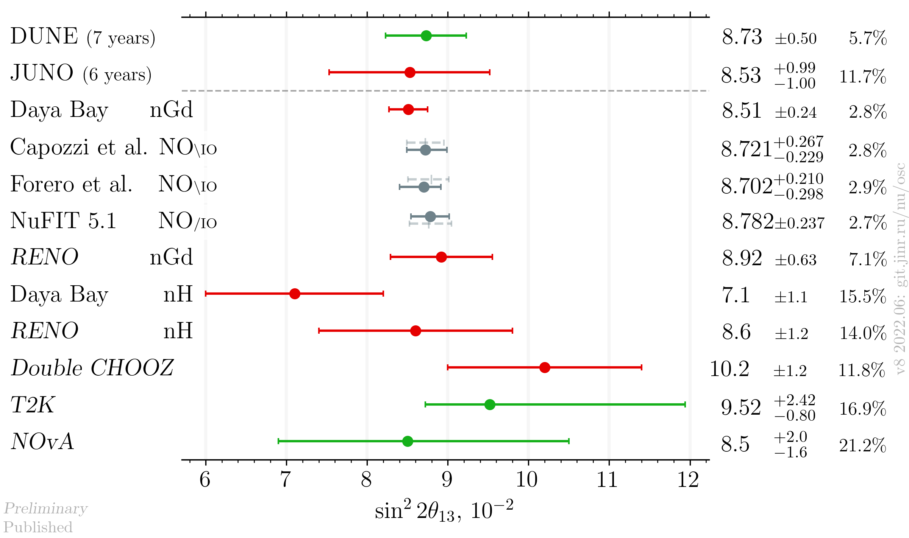
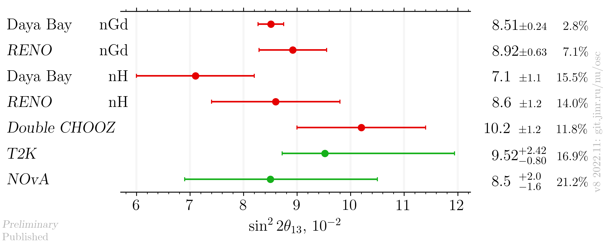

# sin²2θ₁₃ measurements comparison

- Version: **8b**
- Updates since v7:
    * Daya Bay nGd preprint
- [Plotting scripts](samples/theta13/theta13-v8-neutrino2022)
- Data tables:
    * [published](theta13_v8b_published.dat)
    * [latest](theta13_v8b_latest.dat)
- Cross checks by:
    * @ldkolupaeva
    * @maxfl
- Notes:
    * Forero et al. is pre-Neutrino fit
    * dashed grey bar in theoretical entry means IO

## Latest results

###  Including global analyses and future experiments

### Experiments only

## References

| Measurement    |                                                            Published |                                                     Latest |
|----------------|---------------------------------------------------------------------:|-----------------------------------------------------------:|
| Capozzi et al. |                 [hep-ph/2107.00532](data/theor_capozzi_2021-07.yaml) |                                                            |
| DUNE           |                  [hep-ex/2006.16043](data/dune_future_2020_acc.yaml) |                                                            |
| Daya Bay nGd   |          [hep-ex/1809.02261](data/dayabay_2018-06-neutrino2018.yaml) |         [hep-ex/2211.14988](data/dayabay_2022-11-nGd.yaml) |
| Daya Bay nH    |          [hep-ex/1603.03549](data/dayabay_2016-07-neutrino2016.yaml) |                                                            |
| Double CHOOZ   |                        [hep-ex/1901.09445](data/dchooz_2019-01.yaml) |     [Neutrino 2020](data/dchooz_2020-07-neutrino2020.yaml) |
| Forero et al.  | [hep-ph/2006.11237](data/theor_forero_2020-06-pre-neutrino2020.yaml) |                                                            |
| JUNO           |           [hep-ex/2204.13249](data/juno_future_2022-04-reactor.yaml) |                                                            |
| NOvA           |                                                                      |       [Neutrino 2022](data/nova_2022-06-neutrino2022.yaml) |
| NuFIT 5.1      |                       [NuFIT 5.1](data/theor_nufit_5_1_2021-10.yaml) |                                                            |
| RENO nGd       |                          [hep-ex/1806.00248](data/reno_2018-06.yaml) |   [Neutrino 2020](data/reno_2020-07-nGd-neutrino2020.yaml) |
| RENO nH        |                       [hep-ex/1911.04601](data/reno_2019-11_nH.yaml) |    [Neutrino 2022](data/reno_2020-06-nH-neutrino2022.yaml) |
| SuperCHOOZ     |                                                                      | [CERN seminar 2022](https://indico.cern.ch/event/1215214/) |
| T2K            |                           [hep-ex/2101.03779](data/t2k_2021-01.yaml) |        [Neutrino 2020](data/t2k_2020-07-neutrino2020.yaml) |
