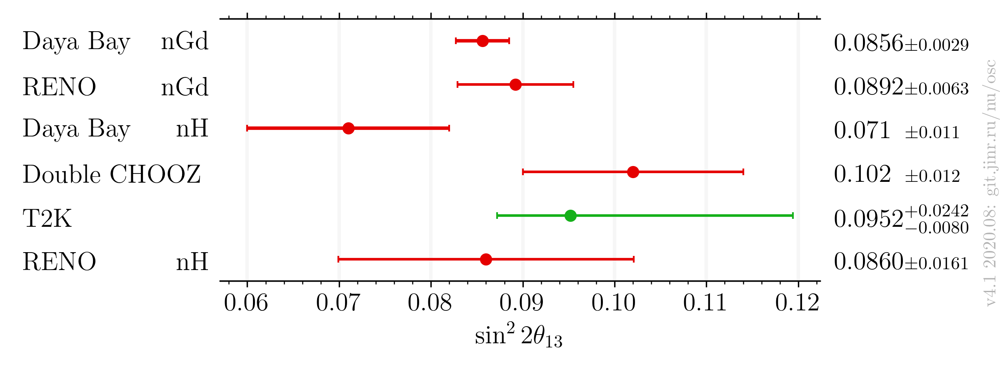
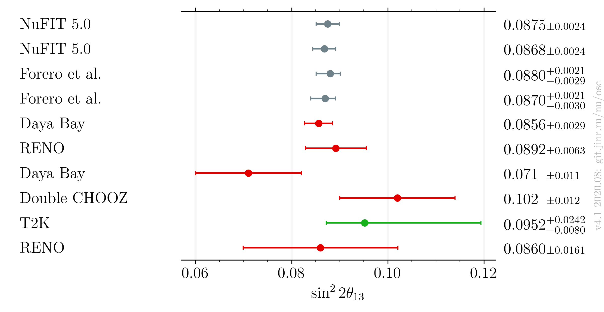

# :warning: This is a beta version of the plot. Use it at your own risk.

# $`\sin^22\theta_{13}`$ measurements comparison, updated after Neutrino 2020

- Version: 4.1 **beta**
- Updates since v4.0:
    * Added global measurements
    * Switched to matplotlib plotting instead of latex
- [Plotting scripts](samples/theta13/v4.1-neutrino2020)
- [Data table](theta13_v4-1.dat)
- References:
    - [Daya Bay nGd](data/dayabay_2018-06-neutrino2018.yaml)
    - [RENO](data/reno_2020-07-neutrino2020.yaml)
    - [Daya Bay nH](data/dayabay_2016-07-neutrino2016.yaml)
    - [Double CHOOZ](data/dchooz_2020-07-neutrino2020.yaml)
    - [T2K](data/t2k_2020-07-neutrino2020.yaml)
- Cross checks by:
    * @ldkolupaeva
    * Beda
- Notes:
    * Forero et al. is pre-Neutrino fit

| Experiments only              | Including global                     |
|-------------------------------|--------------------------------------|
|  |  |

