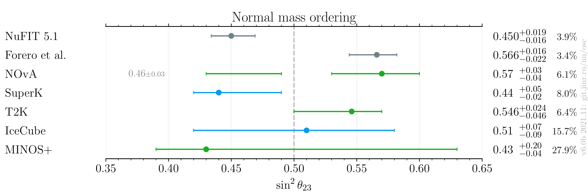
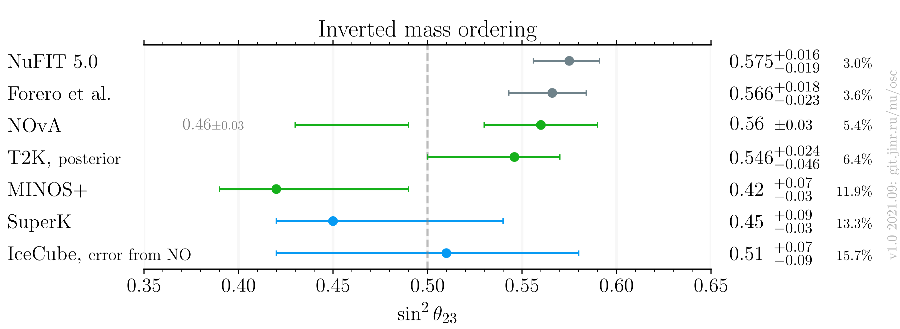

# $`\sin^2 \theta_{23}`$ measurements comparison, after Neutrino 2020

- Version: **2.0b**
- Updates since v1.0:
    * Add future experiments
- [Plotting scripts](samples/theta23/theta23-v2.0-future)
- Data tables:
    * [NO table](theta23_NO_v2-0b.dat)
    * [IO table](theta23_IO_v2-0b.dat)
- References:
    * [MINOS](data/minos_2020-07-neutrino2020.yaml)
    * [IceCube](data/icecube_2020-07-neutrino2020.yaml)
    * [T2K](data/t2k_2020-07-neutrino2020.yaml)
    * [SuperK](data/superk_2020-07-neutrino2020.yaml)
    * [NOvA](data/nova_2020-07-neutrino2020.yaml)
    * [NuFIT 5.0](data/theor_nufit_2020-07-post-neutrino2020.yaml)
    * [Forero et al.](data/theor_forero_2020-06-pre-neutrino2020.yaml)
    - [FUTURE] TBD
- Notes:
    * [T2K](data/t2k_2020-07-neutrino2020.yaml): Bayessian posterior, no particular ordering may be attributed to the number
    * [IceCube](data/icecube_2020-07-neutrino2020.yaml): NO uncertainty is used for the IO result
- Cross checks by:
    * @ldkolupaeva
    * @maxfl

## Including global analyses and future experiments

## Experiments only

