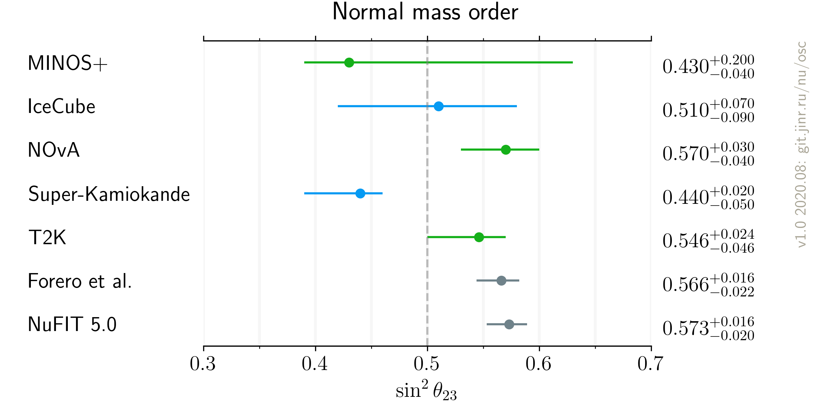
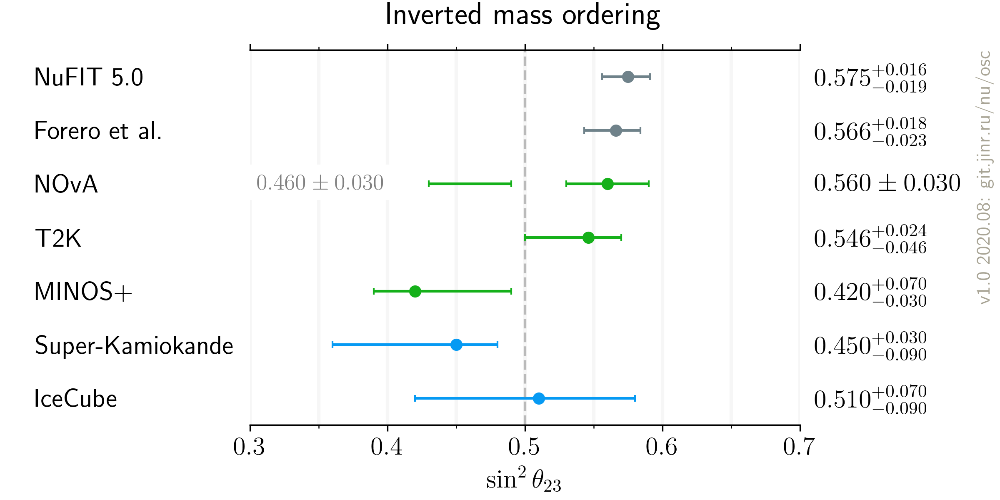

# $`\sin^2 \theta_{23}`$ measurements comparison, updated after Neutrino 2020

- Version: 1.0
- [Plotting scripts](samples/theta23/v2.0-neutrino2020)
- References:
    * [MINOS](data/minos_2020-07-neutrino2020.yaml)
    * [IceCube](data/icecube_2020-07-neutrino2020.yaml)
    * [T2K](data/t2k_2020-07-neutrino2020.yaml)
    * [SuperK](data/superk_2020-07-neutrino2020.yaml)
    * [NOvA](data/nova_2020-07-neutrino2020.yaml)
    * [NuFIT 5.0](data/theor_nufit_2020-07-post-neutrino2020.yaml)
    * [Forero et al.](data/theor_forero_2020-06-pre-neutrino2020.yaml)
- Cross checks by:

- Notes:

| Normal ordering                  | Inverted Ordering                |
| ---                              | ---                              |
|  |  |

