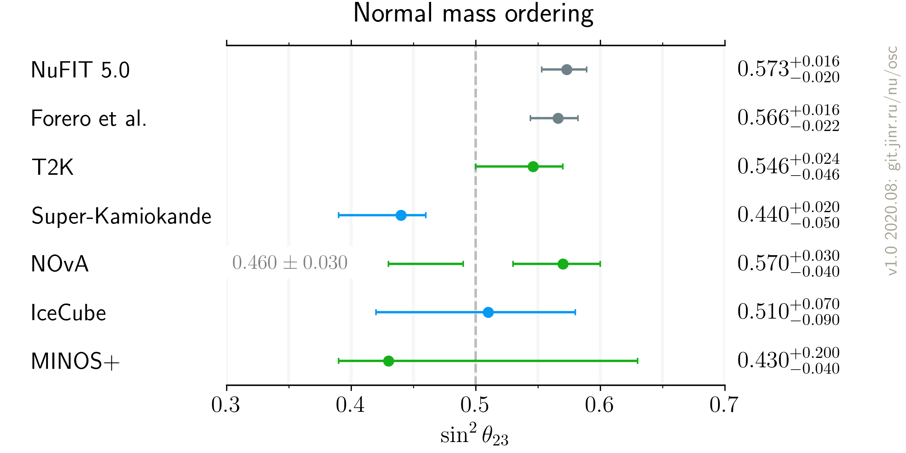
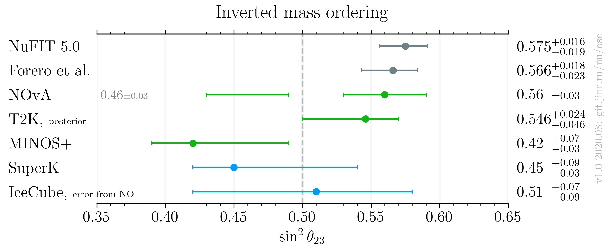

# :warning: This is a beta version of the plot. Use it at your own risk.

# $`\sin^2 \theta_{23}`$ measurements comparison, after Neutrino 2020

- Version: 1.0 **beta**
- [Plotting scripts](samples/theta23/v1.0-neutrino2020)
- References:
    * [MINOS](data/minos_2020-07-neutrino2020.yaml)
    * [IceCube](data/icecube_2020-07-neutrino2020.yaml)
    * [T2K](data/t2k_2020-07-neutrino2020.yaml)
    * [SuperK](data/superk_2020-07-neutrino2020.yaml)
    * [NOvA](data/nova_2020-07-neutrino2020.yaml)
    * [NuFIT 5.0](data/theor_nufit_2020-07-post-neutrino2020.yaml)
    * [Forero et al.](data/theor_forero_2020-06-pre-neutrino2020.yaml)
- Notes:
    * [T2K](data/t2k_2020-07-neutrino2020.yaml): Bayessian posterior, no particular ordering may be attributed to the number
    * [NOvA](data/nova_2020-07-neutrino2020.yaml): NO uncertainty is used for the IO result
- Cross checks by:
    * @ldkolupaeva
    * @maxfl

| Normal ordering                    | Inverted Ordering                  |
| ---                                | ---                                |
|  |  |

