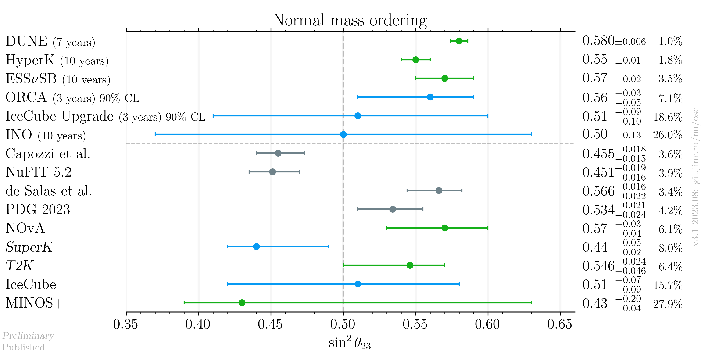
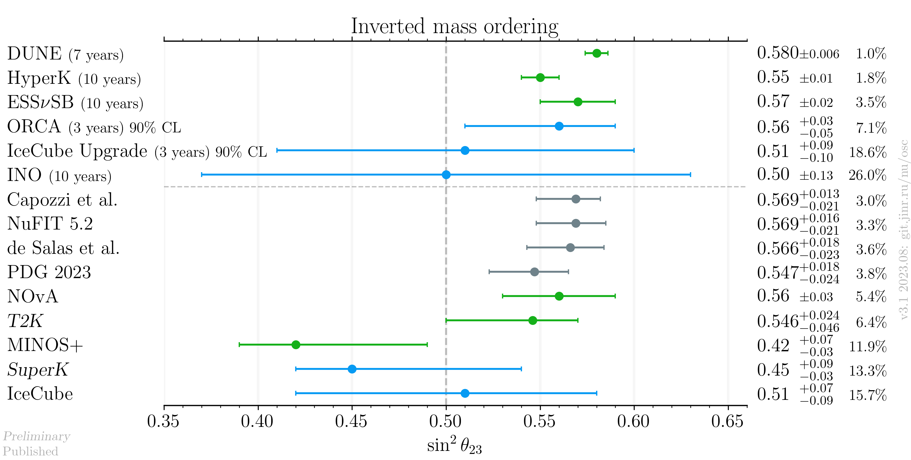
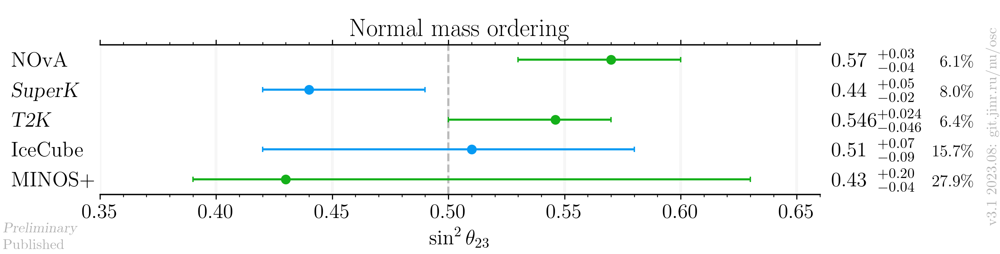
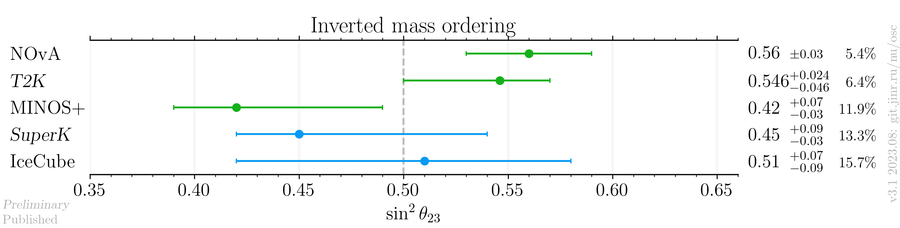

# $`\sin^2 \theta_{23}`$ measurements comparison

- Version: **3.1**
- Updates since v3.0:
    * Add PDG result and update to NuFIT 5.2
- [Plotting scripts](samples/theta23/v3.1)
- Data tables:
    * [NO table](theta23_v3b_NO_latest.dat)
    * [IO table](theta23_v3b_IO_latest.dat)
- Notes:
    * [T2K](data/t2k_2020-07-neutrino2020.yaml): Bayessian posterior, no particular ordering may be attributed to the number
    * [IceCube](data/icecube_2020-07-neutrino2020.yaml): NO uncertainty is used for the IO result
- Cross checks by:
    * @ldkolupaeva

## Plots

### Including global analyses and future experiments

### Experiments only

## References

| Measurement    |                                                            Published |                                                 Latest |
|----------------|---------------------------------------------------------------------:|-------------------------------------------------------:|
| Capozzi et al. |                 [hep-ph/2107.00532](data/theor_capozzi_2021-07.yaml) |                                                        |
| DUNE           |                  [hep-ex/2006.16043](data/dune_future_2020_acc.yaml) |                                                        |
| ESSνSB         |                       [hep-ex/2107.07585](data/ess_future_2021.yaml) |                                                        |
| de Salas et al.| [hep-ph/2006.11237](data/theor_forero_2020-06-pre-neutrino2020.yaml) |                                                        |
| HyperK         |            [hep-ex/1805.04163](data/hyperk_future_2018_acc_atm.yaml) |                                                        |
| IceCube        |          [hep-ex/1707.07081](data/icecube_2020-07-neutrino2020.yaml) |                                                        |
| IceCube future |                   [hep-ex/1911.06745](data/icecube_future_2019.yaml) |                                                        |
| INO            |              [physics.ins-det/1505.07380](data/ino_future_2015.yaml) |                                                        |
| MINOS+         |            [hep-ex/2006.15208](data/minos_2020-07-neutrino2020.yaml) |                                                        |
| NOvA           |             [hep-ex/2108.08219](data/nova_2020-07-neutrino2020.yaml) |                                                        |
| NuFIT 5.2      |         [NuFIT 5.2](data/theor_nufit_5_2_2022-11.yaml)               |                                                        |
| PDG 2023       |         [PDG](data/theor_pdg_2022.yaml)                              |                                                        |      
| ORCA           |                      [hep-ex/2103.09885](data/orca_future_2021.yaml) |                                                        | 
| SuperK         |                        [hep-ex/1901.03230](data/superk_2019-01.yaml) | [Neutrino 2020](data/superk_2020-07-neutrino2020.yaml) |
| T2K            |                 [hep-ex/2101.03779](data_published/t2k_2021-01.yaml) |    [Neutrino 2020](data/t2k_2020-07-neutrino2020.yaml) |

